# AgentForge Architecture

## System Overview

AgentForge has three layers: an ElizaOS v2 plugin backend, a React 19 frontend with ReactFlow, and worker Docker containers deployed to Nosana GPU nodes. The backend plans and orchestrates pipelines. The frontend visualizes them. The workers execute agent tasks.

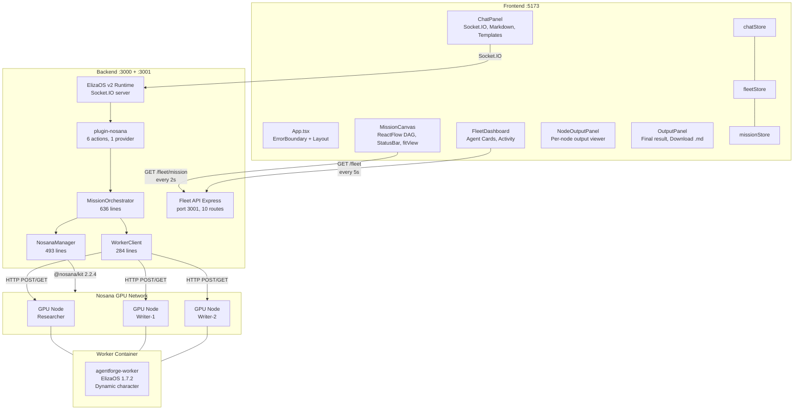

## Backend Architecture

### ElizaOS Plugin System

The `plugin-nosana` plugin registers 6 actions, 1 provider, and 2 plugin routes with ElizaOS. It also starts a standalone Express server on port 3001 for the Fleet API (because ElizaOS plugin routes don't reliably handle all HTTP methods).

```mermaid
classDiagram
    class NosanaPlugin {
        +name: plugin-nosana
        +actions: Action[6]
        +providers: Provider[1]
        +routes: Route[2]
        +init(): start Fleet API
    }
    class MissionOrchestrator {
        +planPipeline(mission): PipelineStep[]
        +execute(mission, callback): MissionResult
        -planFallback(mission): PipelineStep[]
        -buildRootPrompt(task, mission, template)
        -buildSequentialPrompt(task, input)
        -buildMergePrompt(task, inputs)
    }
    class WorkerClient {
        +waitForReady(timeout): agentId
        +sendMessage(agentId, text, timeout, checkAlive, waitForEnrichment)
        -getChannelMessages(channelId, limit)
        -waitForEnrichedResponse(channelId, ids, initial, text, checkAlive)
    }
    class NosanaManager {
        +createAndStartDeployment(params): DeploymentRecord
        +stopDeployment(id): DeploymentRecord
        +getBestMarket(): GpuMarket
        +getNextBestMarket(exclude): GpuMarket
        +getCreditsBalance(): balance
        +getMarkets(): GpuMarket[]
        -waitForRunningOrFallback(id, params, tried)
    }
    NosanaPlugin --> MissionOrchestrator
    MissionOrchestrator --> WorkerClient
    MissionOrchestrator --> NosanaManager
    NosanaManager --> NosanaSDK["@nosana/kit"]
```

### Actions

| Action | File | Lines | Trigger Keywords |
|--------|------|-------|-----------------|
| EXECUTE_MISSION | executeMission.ts | 59 | research+write, mission, pipeline |
| CREATE_AGENT_FROM_TEMPLATE | createAgentFromTemplate.ts | 150 | create, build, make, new agent |
| DEPLOY_AGENT | deployAgent.ts | 98 | deploy, launch, run on nosana |
| CHECK_FLEET_STATUS | checkFleetStatus.ts | 66 | fleet, status, agents, running |
| SCALE_REPLICAS | scaleReplicas.ts | 90 | scale, replicas |
| STOP_DEPLOYMENT | stopDeployment.ts | 96 | stop, shutdown, kill |

### Fleet API Routes (port 3001)

| Method | Path | Handler |
|--------|------|---------|
| GET | /fleet | Fleet status with all deployments |
| GET | /fleet/markets | GPU market list with prices |
| GET | /fleet/credits | Nosana credit balance |
| GET | /fleet/mission | Current pipeline state |
| POST | /fleet/mission/reset | Reset to idle |
| GET | /fleet/mission/history | Last 10 missions |
| POST | /fleet/mission/execute | Start mission via API |
| GET | /fleet/api-docs | Endpoint documentation |
| GET | /fleet/:id/activity | Agent messages for a deployment |
| GET | /fleet/:id | Single deployment details |

---

## MissionOrchestrator (636 lines)

The core engine. Plans pipelines, manages DAG execution, and coordinates agents.

### Pipeline Planning

Two strategies, tried in order:

1. **LLM Planning** (120s timeout). Sends mission to Qwen3.5-27B with a prompt that explains `dependsOn` syntax. Parses JSON array from the response. Handles `dependsOn: -1` (root), `dependsOn: N` (sequential), `dependsOn: [N, M]` (merge).

2. **Fallback Planning** (instant). Regex-based pattern matching. Detects "research", "write", "analyze" keywords. Detects "X AND Y" pattern for parallel branches. Generates appropriate pipeline steps with `dependsOn` fields.

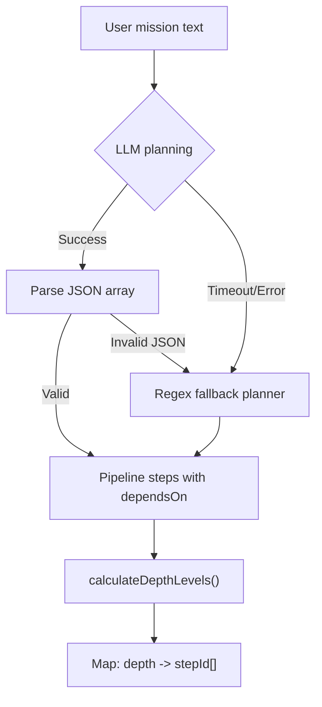

### DAG Depth Calculation

`calculateDepthLevels()` computes the depth of each step by recursively resolving dependencies. Steps with no dependencies are depth 0. Steps depending on depth-0 nodes are depth 1. And so on.

```
Example: Researcher -> [Writer-1, Writer-2] -> Editor

step-0 (Researcher):    dependsOn: none      -> depth 0
step-1 (Writer-1):      dependsOn: step-0    -> depth 1
step-2 (Writer-2):      dependsOn: step-0    -> depth 1
step-3 (Editor):        dependsOn: [1, 2]    -> depth 2

Levels:
  0: [step-0]
  1: [step-1, step-2]    <- run in parallel
  2: [step-3]
```

### Execution Flow

For each depth level, the orchestrator deploys, waits, and executes all nodes in parallel using `Promise.all`.

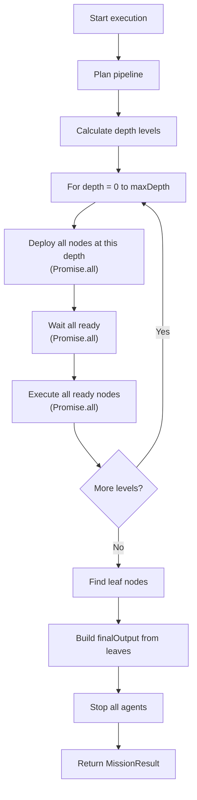

### Pipeline State Machine

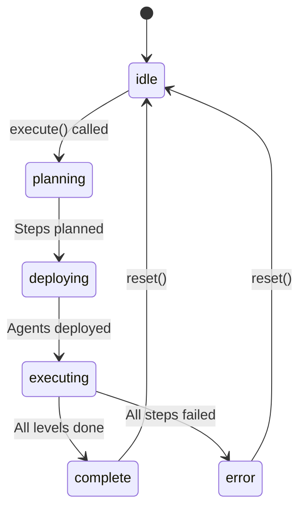

### Prompt Building

Four prompt functions, selected based on dependency structure:

| Function | When Used | Key Instruction |
|----------|-----------|----------------|
| `buildRootPrompt(task, mission, template)` | No dependencies (depth 0) | Researcher: "Use WEB_SEARCH first". Others: "Provide output immediately" |
| `buildSequentialPrompt(task, parentOutput)` | Single parent dependency | "Use ALL the information above" |
| `buildMergePrompt(task, parentOutputs)` | Multiple parent dependencies | "Combine, synthesize, and integrate" |
| `buildFallbackPrompt(task, mission)` | Parent failed or unavailable | "Complete using your own knowledge" |

### State Sync

`syncState()` updates `currentPipelineState` after every status change. `getPipelineState()` enriches it with live deployment data (QUEUED detection via NosanaManager). The frontend polls this every 2 seconds.

---

## WorkerClient (284 lines)

Communicates with deployed ElizaOS agents via their Nosana URLs.

### Dual Strategy

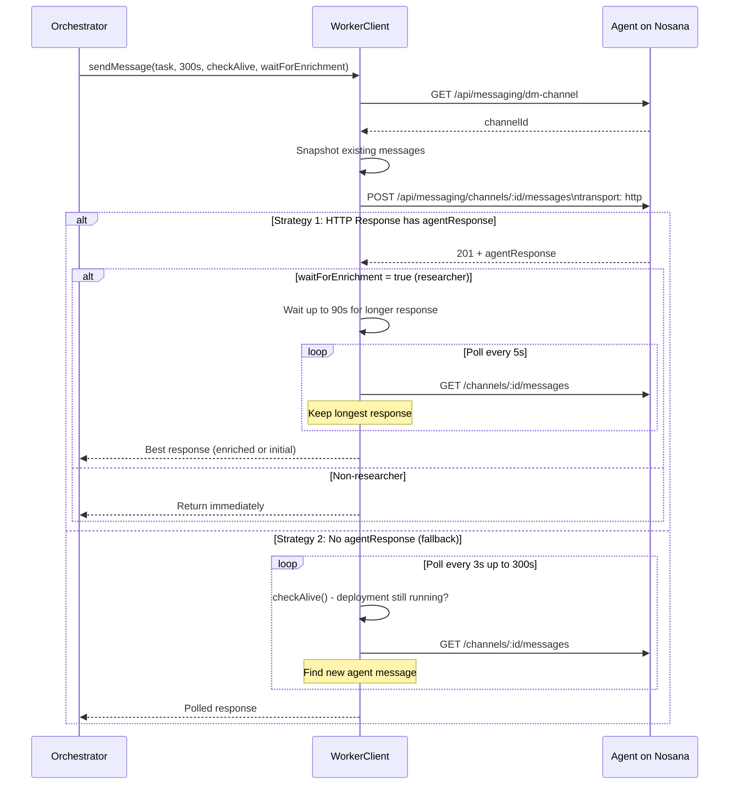

### Timeouts

| Operation | Timeout | Notes |
|-----------|---------|-------|
| HTTP POST (send message) | 300s | Transport: http waits for agent processing |
| Poll interval | 3s | Fallback channel polling |
| Enrichment wait | 90s | Researcher only, after first response |
| Enrichment poll interval | 5s | Check for longer response |
| Health check (waitForReady) | 120s default | Polls /api/agents every 5s |
| DM channel creation | 15s | One-time per message |
| 503 retry delay | 10s | Service Initializing, retry once |

### Web Search Enrichment

When `waitForEnrichment=true` (researcher agents), the client detects the ElizaOS pattern:

```
REPLY (training data, ~3000 chars)  <- captured first
WEB_SEARCH (Tavily, 2-3s)
REPLY (enriched, ~5000+ chars)      <- captured by enrichment wait
```

After getting the first response, it polls channel messages for up to 90 seconds looking for a longer response. Breaks early if a longer message is found after 30+ seconds.

---

## NosanaManager (493 lines)

Wraps `@nosana/kit` for deployment management.

### Deployment Lifecycle

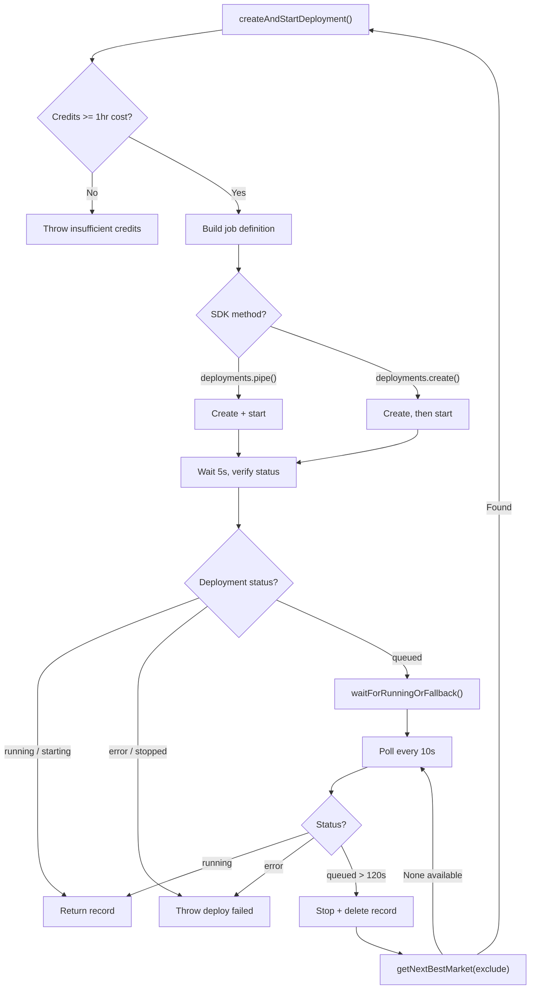

### Market Selection

Markets are fetched from `this.client.api.markets.list()` and cached for 5 minutes. Each market entry includes address, name, GPU type, price per hour, and type (PREMIUM/COMMUNITY).

Only PREMIUM markets are used because community markets reject credit-based payments. `getBestMarket()` returns the cheapest PREMIUM market. `getNextBestMarket(excludeAddresses)` returns the next cheapest, skipping already-tried addresses.

### Graceful Stop

`stopDeployment()` ignores "already stopped", "not running", and "not found" errors. This prevents crashes when cleaning up agents that were stopped by Nosana (container timeout, crash, etc.).

---

## Frontend Architecture

### Component Tree

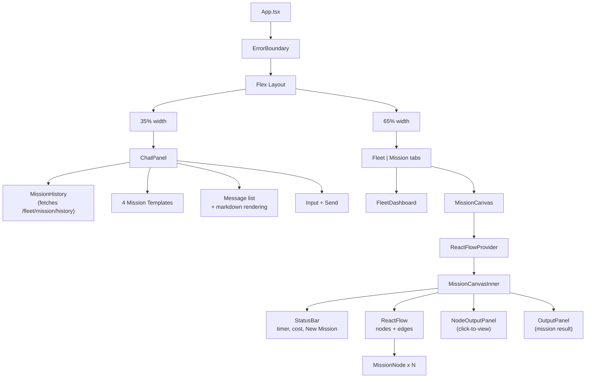

### State Management

Three Zustand stores, each updated by a different mechanism:

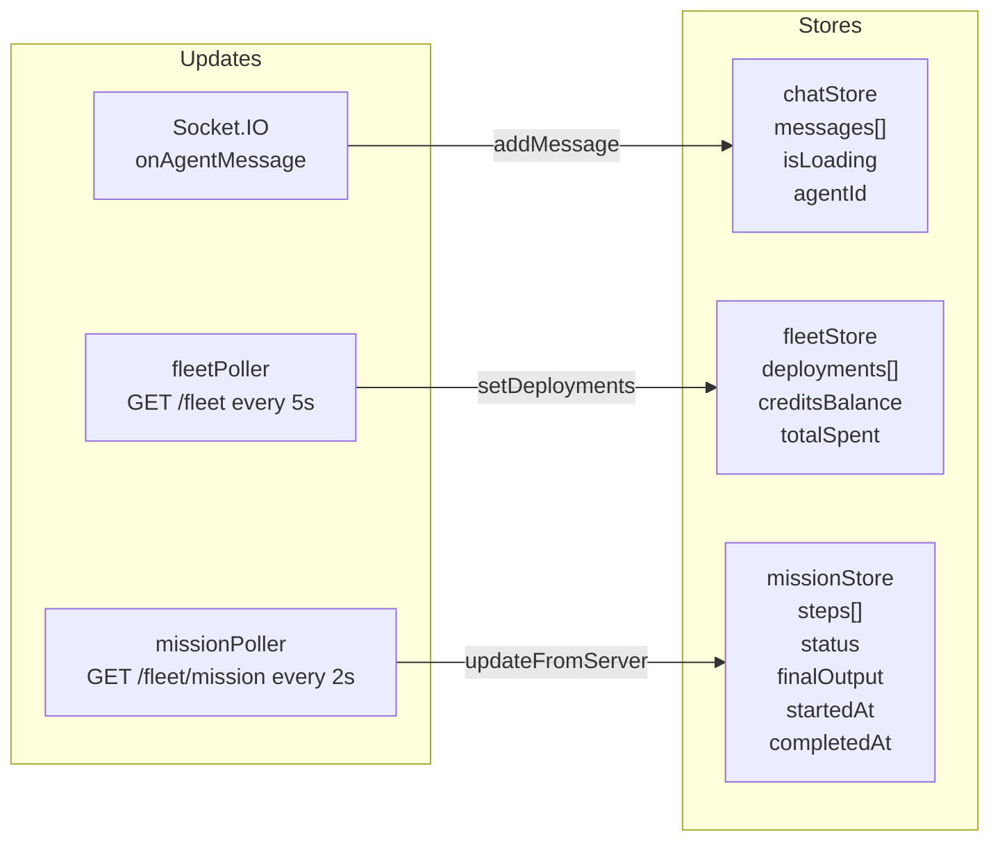

`updateFromServer()` in missionStore has specific logic:
- Non-idle server status always updates the store
- Idle server + local complete/error: preserve (user viewing results)
- Idle server + local active: sync (backend was reset)

### ReactFlow Canvas Layout

Nodes are positioned on a 2D grid using `depth` (X axis) and `parallelIndex` (Y axis):

```
X = BASE_X + (depth + 1) * 300px
Y = CENTER_Y - (totalHeight / 2) + parallelIndex * 200px
```

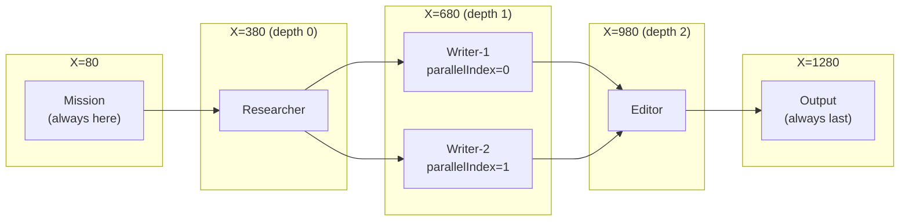

Edges get CSS classes (`processing`, `completed`) that trigger glow and dash animations defined in `index.css`.

### Node Status Visual

| Status | Border Color | Dot | Animation | Label |
|--------|-------------|-----|-----------|-------|
| pending | zinc-700 | zinc-500 | none | Pending |
| deploying | amber-600 | amber-400 pulse | node-pulse | Deploying... |
| queued (deploying+queuedSince) | amber-600 | amber-400 pulse | node-pulse | Queued for GPU... |
| deployed | blue-800 | blue-400 | none | Booting... |
| ready | blue-600 | blue-400 | none | Ready |
| processing | blue-500 | blue-500 ping | node-glow | Processing... |
| complete | green-600 | green-400 | none | Complete |
| error | red-600 | red-400 | none | Error |

Completed and errored nodes show "Click to view output" hint and open `NodeOutputPanel` on click.

---

## Worker Container

### Build

```dockerfile
FROM node:23-slim
# Install bun, copy package.json, install dependencies
# Apply ElizaOS patches for Nosana compatibility
# Copy src/index.ts, build with bun
EXPOSE 3000
CMD ["bun", "run", "start"]
```

### Dynamic Character Generation

`worker/src/index.ts` (71 lines) reads environment variables at boot and constructs an ElizaOS character object:

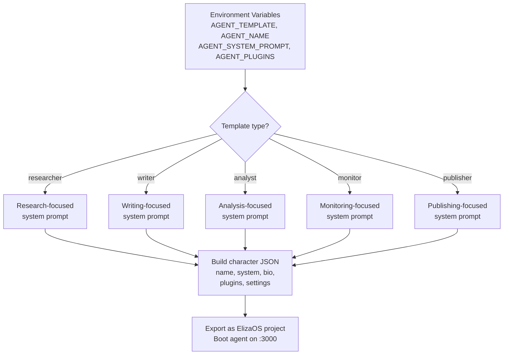

### Plugin Loading

Plugins are loaded based on `AGENT_PLUGINS` env var (comma-separated). Typical configurations:

| Template | Plugins |
|----------|---------|
| researcher | @elizaos/plugin-web-search, @elizaos/plugin-bootstrap, @elizaos/plugin-openai |
| writer | @elizaos/plugin-bootstrap, @elizaos/plugin-openai |
| analyst | @elizaos/plugin-web-search, @elizaos/plugin-bootstrap, @elizaos/plugin-openai |

---

## Data Flow: Complete Mission

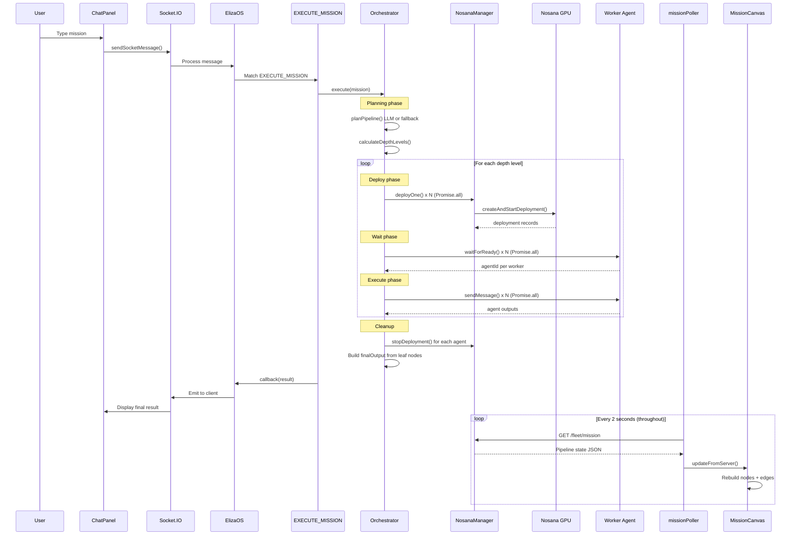

## Limitations

- **LLM planning timeout.** Qwen3.5-27B takes 30-120s for JSON generation. LLM planning succeeds about 50% of the time. Fallback regex planner covers research+write and parallel patterns.
- **Execution time.** Full pipeline: 4-8 minutes. GPU boot ~90s, LLM inference ~60-120s per step, web search enrichment ~60-90s for researchers.
- **In-memory state.** Pipeline state and mission history live in module-level variables. Lost on process restart. No database.
- **Single mission.** One pipeline at a time. The `currentPipelineState` singleton blocks concurrent missions.
- **Embedding endpoint.** Qwen3.5 returns 404 for /v1/embeddings. ElizaOS uses zero-vector fallback. No semantic memory.
- **No streaming.** Agent responses are returned in full after processing. No token-by-token streaming to the frontend.
- **Container boot time.** Each worker takes 60-120s to boot (Docker pull + bun install + ElizaOS init). This dominates total pipeline time.

## File Reference

| File | Lines | Description |
|------|-------|-------------|
| src/index.ts | 22 | ElizaOS project entry, loads character + plugin |
| src/plugins/nosana/index.ts | 194 | Plugin definition + Fleet API Express server |
| src/plugins/nosana/types.ts | 101 | 5 agent templates, 6 GPU market fallbacks, interfaces |
| src/plugins/nosana/actions/executeMission.ts | 59 | EXECUTE_MISSION, single callback |
| src/plugins/nosana/actions/createAgentFromTemplate.ts | 150 | CREATE_AGENT_FROM_TEMPLATE, NLP parameter extraction |
| src/plugins/nosana/actions/deployAgent.ts | 98 | DEPLOY_AGENT, custom container deploy |
| src/plugins/nosana/actions/checkFleetStatus.ts | 66 | CHECK_FLEET_STATUS |
| src/plugins/nosana/actions/scaleReplicas.ts | 90 | SCALE_REPLICAS |
| src/plugins/nosana/actions/stopDeployment.ts | 96 | STOP_DEPLOYMENT |
| src/plugins/nosana/services/missionOrchestrator.ts | 636 | DAG engine, planning, prompts, history |
| src/plugins/nosana/services/nosanaManager.ts | 493 | SDK wrapper, markets, credits, QUEUED fallback |
| src/plugins/nosana/services/workerClient.ts | 284 | Dual send+poll, enrichment, 503 retry |
| src/plugins/nosana/providers/fleetStatusProvider.ts | 28 | Fleet context injection |
| frontend/src/App.tsx | 81 | Layout, tabs, ErrorBoundary, pollers |
| frontend/src/components/ChatPanel.tsx | 354 | Chat, markdown, templates, history, avatar |
| frontend/src/components/FleetDashboard.tsx | 237 | Agent cards, activity panel, stats |
| frontend/src/components/ErrorBoundary.tsx | 54 | React class error boundary |
| frontend/src/components/canvas/MissionCanvas.tsx | 404 | ReactFlow, DAG layout, StatusBar, click-to-view |
| frontend/src/components/canvas/MissionNode.tsx | 159 | Custom node, status colors, handles |
| frontend/src/components/canvas/OutputPanel.tsx | 130 | Result panel, copy, download, stats |
| frontend/src/components/canvas/NodeOutputPanel.tsx | 87 | Per-node output viewer |
| frontend/src/stores/chatStore.ts | 39 | Messages, loading, agentId |
| frontend/src/stores/fleetStore.ts | 64 | Deployments, credits, activity |
| frontend/src/stores/missionStore.ts | 80 | Pipeline state, updateFromServer |
| frontend/src/lib/elizaClient.ts | 148 | Socket.IO connect, join, send, listen |
| frontend/src/lib/missionPoller.ts | 29 | Poll /fleet/mission every 2s |
| frontend/src/lib/fleetPoller.ts | 47 | Poll /fleet every 5s |
| worker/src/index.ts | 71 | Dynamic ElizaOS character from env vars |
