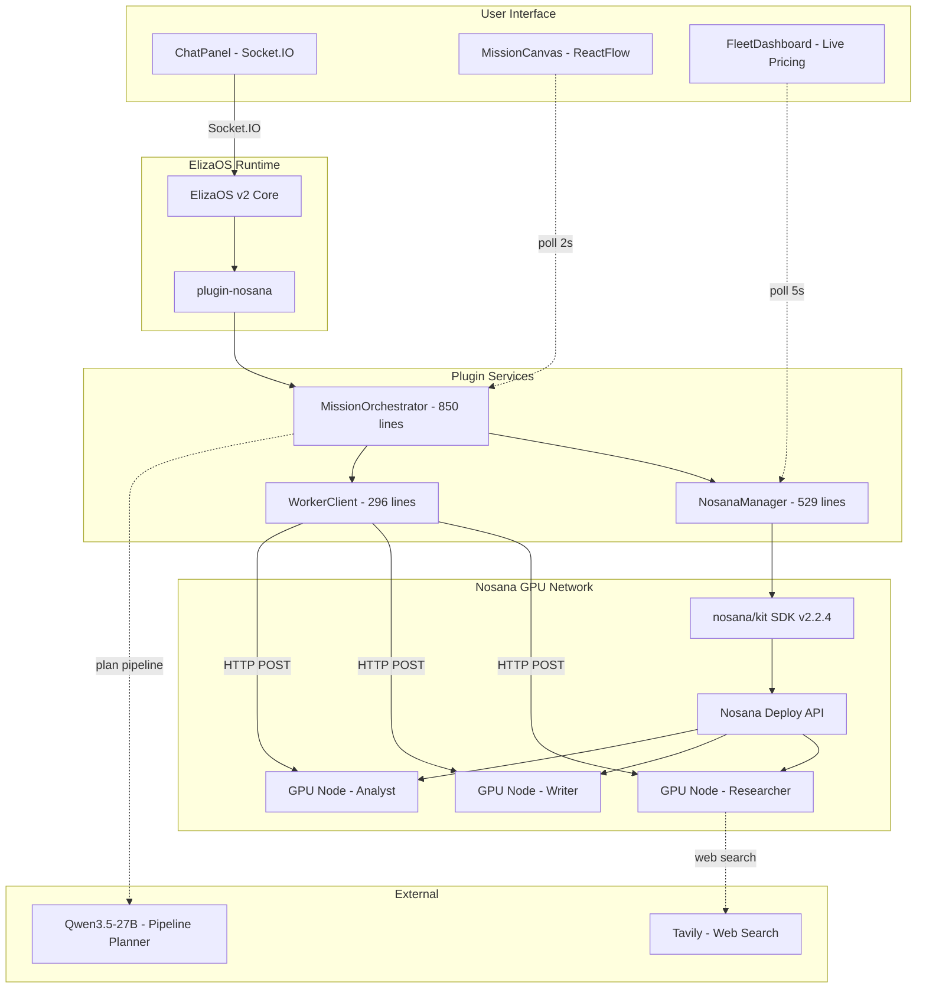
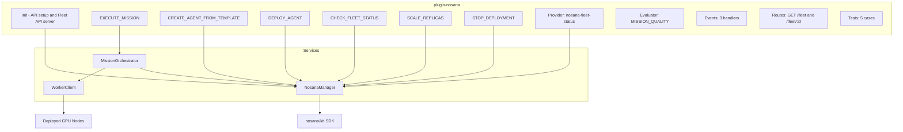
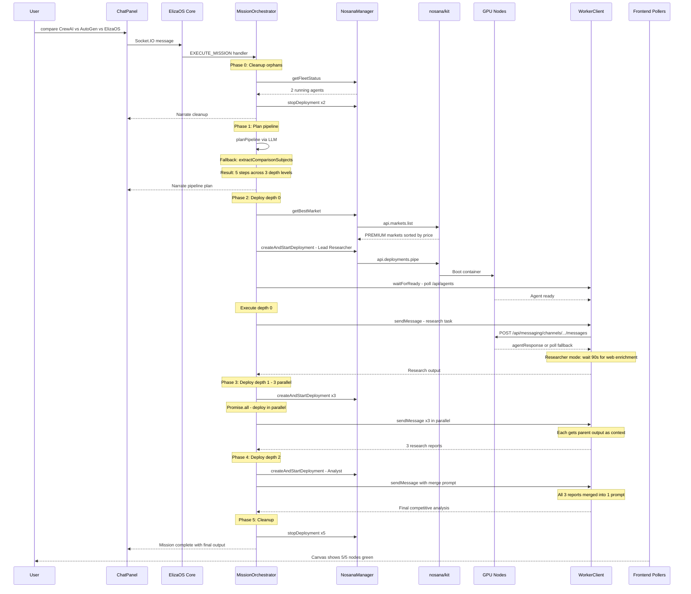
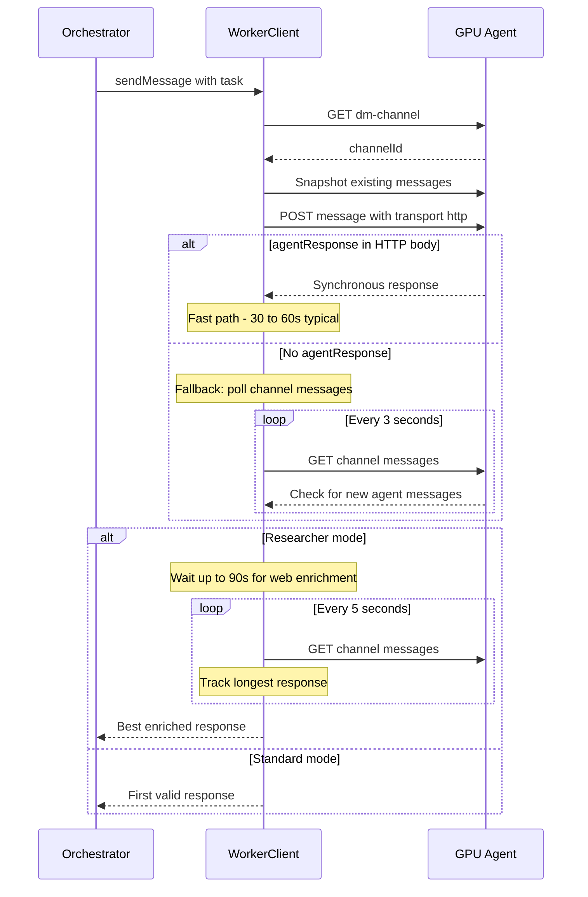
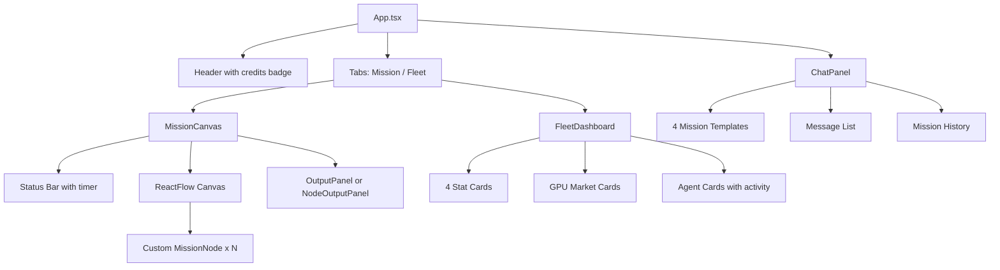

# AgentForge Architecture

Three layers: an ElizaOS v2 plugin backend (~2950 lines TypeScript), a React 19 frontend (~2200 lines), and worker Docker containers deployed to Nosana GPU nodes. The backend plans and orchestrates DAG pipelines. The frontend visualizes them in real-time. The workers execute agent tasks on rented GPUs.

## System Overview

## Plugin Architecture

The plugin implements every field of the ElizaOS `Plugin` interface: actions, providers, evaluators, events, routes, tests, and init.

### init

Called once at plugin load. Does three things:

1. Initializes `NosanaManager` with the API key from `NOSANA_API_KEY`
2. Fetches and logs available GPU markets and credit balance
3. Starts a standalone Express server on port 3001 with 12 REST endpoints (the Fleet API)

The standalone server exists because ElizaOS plugin routes are mounted on the ElizaOS server (port 3000), but the frontend Vite proxy points at port 3001. Both serve the same data.

### Actions

| Action | Trigger | What it does |
|--------|---------|--------------|
| `EXECUTE_MISSION` | "research X and write Y", "compare A vs B" | Plans DAG, deploys agents per depth level, chains outputs, auto-stops |
| `CREATE_AGENT_FROM_TEMPLATE` | "create an agent that..." | Picks template from NLP, deploys single agent |
| `DEPLOY_AGENT` | "deploy X on a 4090" | Deploys a container with optional GPU preference |
| `CHECK_FLEET_STATUS` | "show my fleet", "status" | Lists all deployments with costs and uptime |
| `SCALE_REPLICAS` | "scale X to 3 replicas" | Updates replica count via SDK |
| `STOP_DEPLOYMENT` | "stop the researcher" | Graceful stop with final cost calculation |

Each action has `validate` (regex/keyword matching) and `handler` (async, with callback for chat responses).

## Data Flow - Mission Execution

This is the full sequence for a competitive analysis mission ("compare CrewAI vs AutoGen vs ElizaOS"):

## NosanaManager

Singleton (`getNosanaManager()`). Wraps the `@nosana/kit` SDK. All Nosana API interactions go through this class.

### createAndStartDeployment

The core deployment flow:

1. **Credit pre-check.** Calls `getCreditsBalance()`. If `balance < hourly cost`, throws with a clear message including current balance and required amount
2. **Market validation.** Only PREMIUM markets accepted (community markets reject credit payments)
3. **Job definition.** Builds a Nosana job with `container/run` op, Docker image, exposed port 3000, and env vars
4. **SDK call.** Tries `api.deployments.pipe()` first, falls back to `api.deployments.create()` + `start()` for SDK compatibility
5. **Status verification.** Waits 5 seconds, then refreshes status. If error/stopped, throws immediately
6. **QUEUED handling.** If status is queued, enters `waitForRunningOrFallback`:
   - Polls every 10 seconds
   - After 120 seconds queued, cancels and tries `getNextBestMarket()` (excludes already-tried addresses)
   - Up to 3 market attempts
   - Absolute timeout: 10 minutes

### getCreditsBalance

Dual strategy:
1. SDK method: `api.credits.balance()` - computes `assigned - reserved - settled`
2. HTTP fallback: `GET https://dashboard.k8s.prd.nos.ci/api/credits/balance` with Bearer token and 10s timeout

### Market Selection

`getMarkets()` fetches from API, caches for 5 minutes. Computes user cost as `usd_reward_per_hour * (1 + network_fee_percentage / 100)`. `getBestMarket()` returns the cheapest PREMIUM market. `getNextBestMarket(excludeAddresses)` skips already-tried markets for QUEUED fallback. 6 hardcoded GPU market addresses serve as fallback when the API is unavailable.

### Fleet Status

`getFleetStatus()` auto-refreshes active deployments every 15 seconds via `refreshDeploymentStatus()`. Each refresh calls `api.deployments.get()` and maps the Nosana status string through `NOSANA_STATUS_MAP` (handles `insufficient_funds` to `error`, `queued`, etc). Updates URL from endpoint data.

## MissionOrchestrator

850 lines. The biggest file. Handles DAG planning, parallel execution, and mission lifecycle.

### execute()

The main method. Flow:

1. **Orphan cleanup.** Gets fleet status, stops all running/starting agents from previous missions
2. **Plan pipeline.** Calls `planPipeline()` which tries LLM first, regex fallback second
3. **Calculate depth levels.** `calculateDepthLevels()` does a recursive DFS to assign each step a depth based on its dependencies
4. **Deploy per level.** For each depth level 0..N:
   - Deploy all agents at this level in parallel (`Promise.all`)
   - Wait for all to be ready (`waitForReady` with 180s timeout + market fallback)
   - Execute all ready agents in parallel (`Promise.all`)
   - Narrate completion with timing
5. **Determine final output.** Leaf nodes (no other step depends on them) provide the output. Single leaf = use directly. Multiple leaves = concatenate with headers
6. **Cleanup.** Stop all deployed agents

### planPipeline()

Two strategies:

**LLM Planner.** Sends mission to the LLM endpoint (`OPENAI_BASE_URL/chat/completions`) with a system prompt that explains the template/dependency format. Expects a JSON array. Temperature 0.3, timeout 120s.

**Regex Fallback.** Pattern matching for common mission types:
- Competitive analysis: detects "competitive analysis", "vs", "compare". Uses `extractComparisonSubjects()` to parse "X vs Y vs Z". Generates 5-step pipeline: 1 lead researcher, N parallel subject researchers, 1 analyst
- Parallel "AND" pattern: splits on "and" for 3+ segments
- Sequential keywords: chains researcher, analyst, writer based on detected keywords
- Default: researcher then writer

### Pipeline State

Exposed via `getPipelineState()` for the REST endpoint. Frontend polls `GET /fleet/mission` every 2 seconds. State includes step status, output preview (first 300 chars), deployment IDs, URLs, market info, depth/parallel index for canvas layout.

### Prompt Engineering

4 prompt builders handle different pipeline positions:

- `buildRootPrompt()` - first step, no parent input. Researcher variant includes web search instructions. All include anti-acknowledgment instructions ("Do NOT say 'I will research'. Actually DO the research RIGHT NOW")
- `buildSequentialPrompt()` - single parent. Includes parent output as context
- `buildMergePrompt()` - multiple parents. Includes all parent outputs. Adds structured report requirements (executive summary, comparison table, etc.)
- `buildFallbackPrompt()` - parent failed. Uses own knowledge

## WorkerClient

Communicates with deployed ElizaOS instances running on GPU nodes.

### Dual Strategy for Message Delivery

**Strategy 1 - HTTP Synchronous.** POST to `/api/messaging/channels/{id}/messages` with `transport: "http"`. ElizaOS processes the message and returns `agentResponse` in the HTTP body. Works about 50% of the time with Qwen3.5.

**Strategy 2 - Channel Polling.** If no `agentResponse`, poll channel messages every 3 seconds. Filters out orchestrator's own messages and messages shorter than 20 chars. Takes the latest agent message. Timeout: 300 seconds.

**503 Retry.** If the POST returns 503 (service initializing), waits 10 seconds and retries once.

**Enrichment Wait.** For researcher agents (`waitForEnrichment: true`), after getting the initial response, polls for up to 90 seconds looking for a longer response. This catches the pattern where the agent replies immediately, then does a web search, then replies again with richer content. Takes the longest response found. Confirms after 30 seconds if an enriched response was found.

## Frontend Architecture

React 19, Vite 8, Tailwind 4, 11 shadcn/ui components. Split into 3 stores (Zustand), 4 pollers/clients, and 7 UI components.

### Component Tree

### Stores

| Store | File | Purpose |
|-------|------|---------|
| `chatStore` | 39 lines | Messages array, loading state, agent ID |
| `fleetStore` | 77 lines | Deployments, markets, credits, agent activity |
| `missionStore` | 80 lines | Pipeline status, steps, final output. `updateFromServer()` maps API response |

### Polling

| Poller | Interval | Endpoint | Store |
|--------|----------|----------|-------|
| Fleet status | 5s | `GET /fleet` | `fleetStore.setDeployments` |
| Credits | 30s | `GET /fleet/credits` | `fleetStore.setCreditsBalance` |
| Markets | 60s | `GET /fleet/markets` | `fleetStore.setMarkets` |
| Mission | 2s | `GET /fleet/mission` | `missionStore.updateFromServer` |

All pollers use `setInterval` with proper cleanup on unmount. Errors are silently ignored (best-effort polling).

### Socket.IO Client

`elizaClient.ts` handles agent discovery (`GET /api/agents`), DM channel creation, and real-time messaging. Connects to ElizaOS on the same origin. Listens for `messageBroadcast` events and dispatches to registered listeners. Chat panel registers one listener that filters out internal messages (`Executing action:` prefix) and adds agent responses to the chat store.

## File Reference

### Backend (2950 lines)

| File | Lines | Description |
|------|-------|-------------|
| `src/index.ts` | 22 | Project entry point. Loads character, exports plugin |
| `src/plugins/nosana/index.ts` | 263 | Plugin definition, 12 Express routes, Fleet API server |
| `src/plugins/nosana/types.ts` | 102 | Interfaces, 6 GPU market fallbacks, 5 agent templates |
| `src/plugins/nosana/actions/executeMission.ts` | 79 | Multi-agent DAG pipeline execution |
| `src/plugins/nosana/actions/createAgentFromTemplate.ts` | 150 | NLP template selection and deployment |
| `src/plugins/nosana/actions/deployAgent.ts` | 98 | Direct container deployment |
| `src/plugins/nosana/actions/checkFleetStatus.ts` | 66 | Fleet status reporting |
| `src/plugins/nosana/actions/scaleReplicas.ts` | 90 | Replica scaling |
| `src/plugins/nosana/actions/stopDeployment.ts` | 96 | Graceful shutdown with cost calculation |
| `src/plugins/nosana/services/missionOrchestrator.ts` | 850 | DAG planning, parallel execution, prompts, narration |
| `src/plugins/nosana/services/nosanaManager.ts` | 529 | Nosana SDK wrapper, markets, credits, deployments |
| `src/plugins/nosana/services/workerClient.ts` | 296 | HTTP communication with deployed agents |
| `src/plugins/nosana/providers/fleetStatusProvider.ts` | 28 | Fleet status context provider |
| `src/plugins/nosana/evaluators/missionQualityEvaluator.ts` | 90 | 5-criteria quality scoring |
| `src/plugins/nosana/events/actionMetrics.ts` | 102 | Action duration tracking, stale entry cleanup |
| `src/plugins/nosana/tests/pluginTests.ts` | 89 | 5 plugin validation tests |
| `tests/unit.test.ts` | 200 | 5 unit tests (markets, templates, DAG, patterns, records) |

### Frontend (2214 lines)

| File | Lines | Description |
|------|-------|-------------|
| `frontend/src/App.tsx` | 104 | Root layout, tabs, polling lifecycle |
| `frontend/src/components/ChatPanel.tsx` | 360 | Chat UI, Socket.IO, templates, mission history |
| `frontend/src/components/FleetDashboard.tsx` | 294 | GPU markets, deployments, stat cards, activity panels |
| `frontend/src/components/ErrorBoundary.tsx` | 67 | React error boundary with ReactFlow recovery |
| `frontend/src/components/canvas/MissionCanvas.tsx` | 506 | ReactFlow canvas, auto-layout, status bar, export |
| `frontend/src/components/canvas/MissionNode.tsx` | 165 | Custom ReactFlow node with status animations |
| `frontend/src/components/canvas/OutputPanel.tsx` | 129 | Final output viewer with copy/download |
| `frontend/src/components/canvas/NodeOutputPanel.tsx` | 115 | Per-node output viewer |
| `frontend/src/stores/chatStore.ts` | 39 | Chat messages, loading state |
| `frontend/src/stores/fleetStore.ts` | 77 | Fleet state, markets, credits |
| `frontend/src/stores/missionStore.ts` | 80 | Pipeline state, step mapping |
| `frontend/src/lib/elizaClient.ts` | 139 | Socket.IO client, agent discovery |
| `frontend/src/lib/fleetPoller.ts` | 73 | Fleet/credits/markets polling |
| `frontend/src/lib/missionPoller.ts` | 29 | Pipeline state polling |
| `frontend/src/lib/markdown.ts` | 21 | Shared markdown-to-HTML renderer |
| `frontend/src/lib/utils.ts` | 6 | Tailwind class merge (cn) |

## Docker

Two Docker images:

**Main image** (`drewdockerus/agent-challenge:latest`). Built from `Dockerfile`. Runs ElizaOS with the plugin-nosana plugin. Exposes ports 3000 (ElizaOS) and 3001 (Fleet API). Base: `node:23-slim`. Installs bun, builds frontend, compiles TypeScript.

**Worker image** (`drewdockerus/agentforge-worker:latest`). Deployed to GPU nodes by the orchestrator. Runs a standalone ElizaOS instance with template-specific plugins. Receives tasks via HTTP from the WorkerClient on the main instance.

## Environment Variables

| Variable | Used In | Default | Purpose |
|----------|---------|---------|---------|
| `NOSANA_API_KEY` | nosanaManager.ts, index.ts | empty (mock mode) | Nosana platform API key |
| `OPENAI_API_KEY` | orchestrator, actions, workers | `nosana` | LLM inference API key |
| `OPENAI_BASE_URL` | orchestrator, actions, workers | empty | LLM inference endpoint |
| `OPENAI_SMALL_MODEL` | orchestrator, actions, workers | `Qwen3.5-27B-AWQ-4bit` | LLM model for planning and agents |
| `OPENAI_LARGE_MODEL` | actions, workers | `Qwen3.5-27B-AWQ-4bit` | LLM model (large variant) |
| `MODEL_NAME` | orchestrator, workers | `Qwen3.5-27B-AWQ-4bit` | Legacy model name for workers |
| `OPENAI_API_URL` | actions, workers | empty | Legacy URL for workers |
| `TAVILY_API_KEY` | workers | empty | Web search for researcher agents |
| `AGENTFORGE_WORKER_IMAGE` | orchestrator, actions | `drewdockerus/agentforge-worker:latest` | Docker image for worker agents |
| `FLEET_API_PORT` | index.ts | `3001` | Fleet API server port |
| `SERVER_PORT` | Dockerfile | `3000` | ElizaOS server port |
