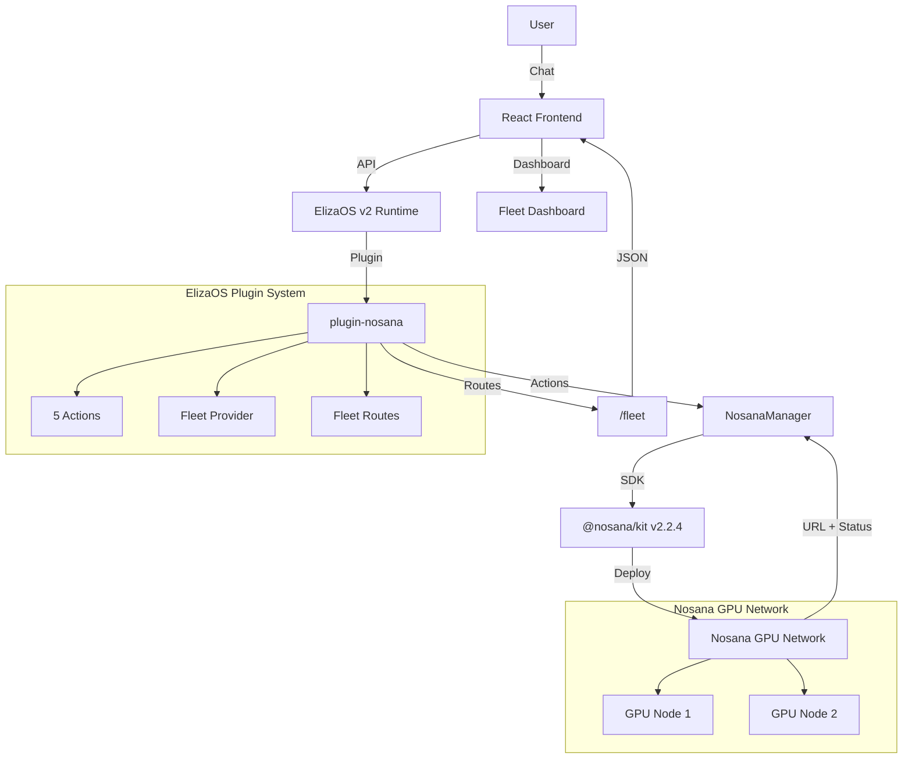

# AgentForge — AI Agent Factory on Nosana

A meta-agent built with ElizaOS v2 that creates, deploys, and manages other AI agents on the Nosana decentralized GPU network through natural language conversation.


## What is AgentForge?

AgentForge is your personal AI agent factory. Chat with it in plain English, describe the agent you want, and AgentForge handles everything:

1. **Template Selection** — picks the best agent template (researcher, writer, monitor, publisher, analyst)
2. **Configuration** — generates character files, selects plugins, sets system prompts
3. **Deployment** — deploys to Nosana's decentralized GPU network via `@nosana/kit`
4. **Fleet Management** — monitors status, scales replicas, tracks costs, stops agents

Every agent runs on decentralized compute — no AWS, no GCP, no Azure.

## Architecture



## Nosana Integration

AgentForge integrates deeply with the Nosana decentralized GPU network through the `@nosana/kit` SDK v2.2.4. This section covers every aspect of the integration.

### Client Initialization

The Nosana client is initialized once via the singleton `NosanaManager`:

```typescript
import { createNosanaClient } from '@nosana/kit';

const client = createNosanaClient('mainnet', {
  api: { apiKey: process.env.NOSANA_API_KEY },
});
```

The `createNosanaClient` function accepts:
- `network` — `'mainnet'`, `'devnet'`, or `'localnet'`
- `customConfig` — partial configuration including API credentials

### Creating Deployments

AgentForge uses the `pipe()` method for atomic create-and-start operations:

```typescript
const deployment = await client.api.deployments.pipe(
  {
    name: 'my-agent',
    market: MARKET_ADDRESS,
    timeout: 300,
    replicas: 1,
    strategy: 'SIMPLE',
    job_definition: {
      version: '0.1',
      type: 'container',
      meta: { trigger: 'api' },
      ops: [{
        type: 'container/run',
        id: 'agent',
        args: {
          image: 'andy00l/agentforge-worker:latest',
          ports: ['3000:3000'],
          env: { /* agent config */ },
        },
      }],
    },
  },
  async (dep) => {
    await dep.start();
  }
);
```

Alternatively, deployments can be created in two steps:
```typescript
const created = await client.api.deployments.create(body);
const deployment = await client.api.deployments.get(created.id);
await deployment.start();
```

### Scaling Deployments

Replica count is adjusted with `updateReplicaCount()`:

```typescript
const deployment = await client.api.deployments.get(deploymentId);
await deployment.updateReplicaCount(3); // Scale to 3 replicas
```

Each replica runs on a separate GPU node. Cost scales linearly with replicas.

### Stopping Deployments

```typescript
const deployment = await client.api.deployments.get(deploymentId);
await deployment.stop();
```

Stopped deployments release GPU resources immediately.

### Fleet Management and Cost Tracking

The `NosanaManager` singleton maintains an in-memory fleet registry:
- Tracks all deployments (ID, name, status, market, replicas, cost, uptime)
- Calculates real-time cost: `hours_running * cost_per_hour * replicas`
- Provides fleet-wide aggregates (total cost/hr, active count, total replicas)

### GPU Market Selection

Nosana offers multiple GPU markets with different capabilities and pricing:

| Market | GPU | Est. Cost/hr |
|--------|-----|-------------|
| `nvidia-3090` | NVIDIA RTX 3090 | $0.15 |
| `nvidia-4090` | NVIDIA RTX 4090 | $0.30 |
| `cpu-only` | CPU Only | $0.05 |

Markets are identified by Solana public keys. AgentForge auto-selects based on agent template:
- Research/Monitor/Analyst agents → RTX 3090
- Writer/Publisher agents → CPU Only

### Mock Mode for Development

When no `NOSANA_API_KEY` is set, AgentForge runs in mock mode:
- Deployments are simulated with mock IDs (`mock-xxx`)
- Fleet status and costs are tracked in memory
- All CRUD operations work identically
- No real GPU resources are consumed

This enables full development and testing without a Nosana account.

### Error Handling

The SDK integration handles:
- Missing API keys (falls back to mock mode)
- Failed deployments (error propagation to chat)
- Network timeouts (configurable per deployment)
- Status refresh failures (graceful degradation)

## ElizaOS Plugin Architecture

### Actions

| Action | Trigger Keywords | Description |
|--------|-----------------|-------------|
| `CREATE_AGENT_FROM_TEMPLATE` | create, build, make, new agent | Picks template, configures, and deploys |
| `DEPLOY_AGENT` | deploy, launch, run on nosana | Direct deployment with custom config |
| `CHECK_FLEET_STATUS` | fleet, status, my agents, show | Lists all deployments with metrics |
| `SCALE_REPLICAS` | scale, replica, increase, decrease | Adjusts replica count |
| `STOP_DEPLOYMENT` | stop, kill, shutdown, terminate | Stops a running deployment |

### Provider

The `fleetStatusProvider` injects current fleet state into every LLM context, enabling the agent to reason about existing deployments when responding.

### Routes

Fleet data is served via a standalone fleet API server on port 3001 (and also as ElizaOS plugin routes when loaded):
- `GET /fleet` — full fleet status with costs
- `GET /fleet/:id` — single deployment details

## Agent Templates

### Researcher
Web-enabled research agent. Searches the web, synthesizes findings, produces structured reports.
- **Plugins**: web-search, bootstrap, openai
- **Default GPU**: RTX 3090

### Writer
Content generation agent. Produces blog posts, summaries, reports, social copy.
- **Plugins**: bootstrap, openai
- **Default GPU**: CPU Only

### Monitor
Periodic scanning agent. Watches websites and feeds for matching content.
- **Plugins**: web-search, bootstrap, openai
- **Default GPU**: RTX 3090

### Publisher
Social media agent. Formats and publishes content to configured channels.
- **Plugins**: bootstrap, openai
- **Default GPU**: CPU Only

### Analyst
Data analysis agent. Analyzes data, identifies trends, generates insights.
- **Plugins**: web-search, bootstrap, openai
- **Default GPU**: RTX 3090

## Setup

### Prerequisites

- [Node.js](https://nodejs.org/) 22+
- [Bun](https://bun.sh/) runtime
- [ElizaOS CLI](https://elizaos.com): `npm install -g @elizaos/cli`

### Local Development

```bash
# Clone and install
git clone https://github.com/andy00l/agentforge.git
cd agentforge/agent-challenge-4
bun install

# Copy environment
cp .env.example .env
# Edit .env with your settings

# Start ElizaOS with AgentForge
bun run dev

# In another terminal — start the frontend
cd frontend && npm install && npm run dev
```

Open http://localhost:5173 to use the dashboard.

### With Nosana API Key

1. Get an API key at https://deploy.nosana.com/account/
2. Add to `.env`: `NOSANA_API_KEY=nos_xxx_your_key`
3. Restart — agents will now deploy to real GPU nodes

### Docker

```bash
docker build -t andy00l/agentforge:latest .
docker run -p 3000:3000 --env-file .env andy00l/agentforge:latest
```

### Deploy to Nosana

```bash
nosana deploy --file nos_job_def/nosana_eliza_job_definition.json
```

## Tech Stack

- **ElizaOS v2** (v1.7.2) — Agent framework with plugin system
- **@nosana/kit** (v2.2.4) — Nosana decentralized GPU SDK
- **TypeScript** — Full type safety across backend and frontend
- **React 19** + **Vite** — Frontend with hot reload
- **Tailwind CSS v4** — Utility-first styling
- **Zustand** — Lightweight state management
- **Qwen3.5-27B-AWQ** — LLM via Nosana inference endpoint

## Project Structure

```
agent-challenge-4/
├── characters/
│   └── forge-master.character.json     # AgentForge persona
├── src/
│   ├── index.ts                        # Plugin entry point + fleet server
│   ├── server/
│   │   └── fleetServer.ts              # Standalone fleet API (port 3001)
│   └── plugins/nosana/
│       ├── index.ts                    # Plugin definition + routes
│       ├── types.ts                    # TypeScript interfaces
│       ├── actions/                    # 5 ElizaOS actions
│       ├── providers/                  # Fleet status provider
│       └── services/
│           └── nosanaManager.ts        # Nosana SDK wrapper
├── frontend/
│   └── src/
│       ├── App.tsx                     # Split-panel layout
│       ├── components/
│       │   ├── ChatPanel.tsx           # Chat interface
│       │   └── FleetDashboard.tsx      # Fleet monitoring
│       ├── stores/                     # Zustand state
│       └── lib/                        # API client + poller
├── nos_job_def/
│   └── nosana_eliza_job_definition.json
├── Dockerfile
└── package.json
```

## Video Demo

[Coming soon]

## License

MIT
