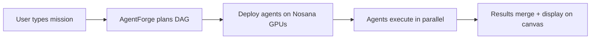
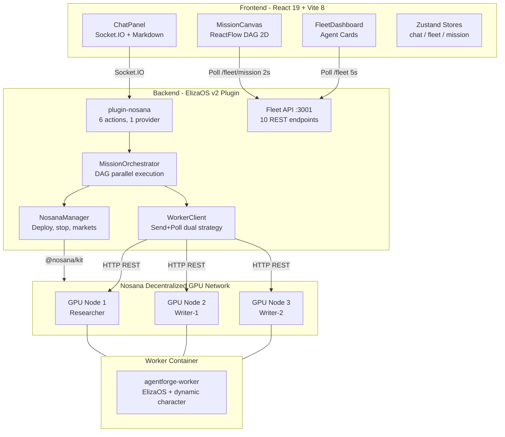
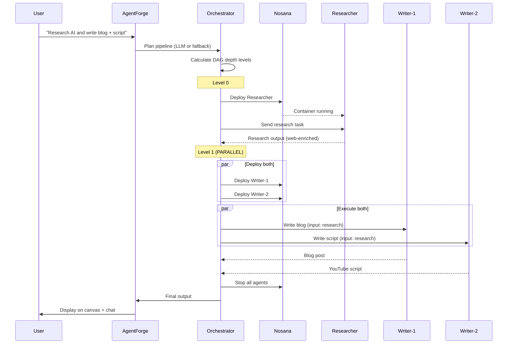
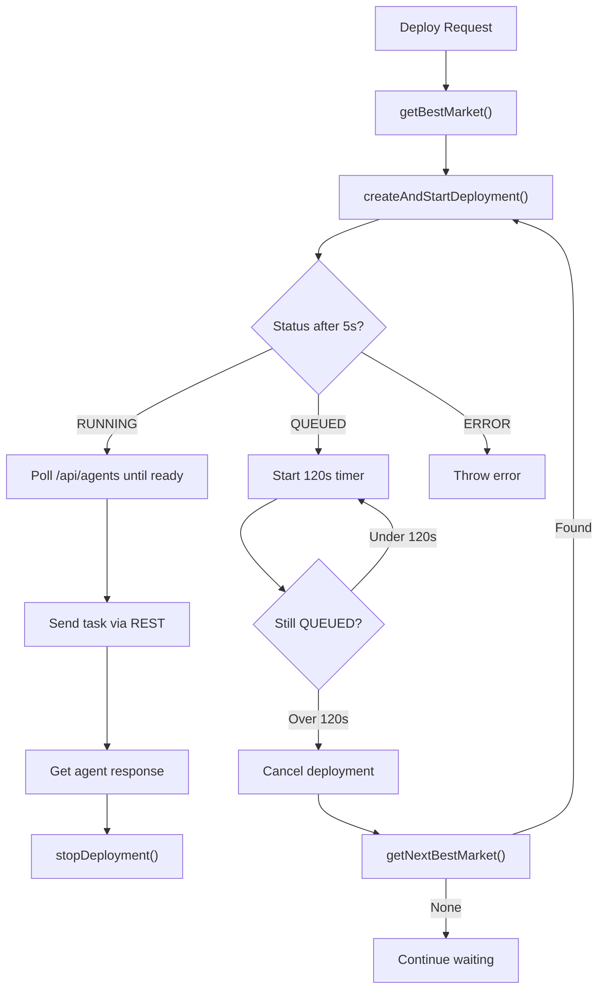

# AgentForge

An AI agent factory built on ElizaOS v2 that deploys multi-agent pipelines to Nosana's decentralized GPU network. You describe a mission in plain English, AgentForge plans a DAG of specialized agents, deploys them to separate GPU nodes, and orchestrates parallel execution.

    


## What AgentForge Does

You type "Research AI trends and write me a blog post AND a YouTube script" into a chat panel. AgentForge plans a pipeline of 4 agents (Researcher, Blog-Writer, Script-Writer, Final-Editor), deploys each as a separate Docker container on Nosana GPU nodes, runs the Researcher first, then the two Writers in parallel on separate GPUs, then merges everything with the Final-Editor. The full pipeline runs in 4-8 minutes. All agents auto-stop when done to save credits.



## Key Features

**DAG Parallel Pipelines.** Agents can run in parallel when they don't depend on each other. The orchestrator calculates depth levels from the dependency graph and uses `Promise.all` at each level. A mission like "research X, write a blog AND a script" runs the two writers simultaneously on separate GPU nodes.

**Live ReactFlow Canvas.** A 2D node graph shows every agent's status in real time. Nodes change color as they progress (pending, deploying, queued, processing, complete, error). Edges glow and animate when data flows between agents. Click any completed node to read its full output.

**Web Search Enrichment.** Researcher agents use Tavily for real web searches. The worker client detects the ElizaOS REPLY/WEB_SEARCH/REPLY pattern and waits up to 90 seconds for the web-enriched response instead of returning the initial training-data reply.

**Automatic GPU Market Fallback.** If a GPU market is full (QUEUED status), AgentForge waits 120 seconds, then cancels and redeploys on the next cheapest available market. Tries up to 3 markets before giving up.

**Mission Templates.** Four pre-built mission templates (Research Pipeline, Content Pipeline, Competitive Analysis, Quick Agent) launch with one click. The chat panel renders markdown with headers, lists, code blocks, and horizontal rules.

**REST API.** A standalone Fleet API on port 3001 exposes 10 endpoints for programmatic control. Start missions, check status, view history, and read API docs without the chat UI.

## Architecture



See [ARCHITECTURE.md](./ARCHITECTURE.md) for detailed technical documentation with 10+ Mermaid diagrams.

## How It Works: DAG Pipeline



## Nosana Integration

### Programmatic Deployment

Every agent is deployed programmatically using `@nosana/kit` v2.2.4. The `NosanaManager` class (493 lines) wraps the SDK and handles the full lifecycle: market selection, credit checks, deployment creation, status polling, and cleanup.

When `createAndStartDeployment()` is called, it builds a Nosana job definition with the Docker image `drewdockerus/agentforge-worker:latest`, maps port 3000, injects environment variables (LLM endpoint, API keys, agent template, system prompt), and submits it to the selected GPU market. The deployment body uses the `SIMPLE` strategy with configurable timeout and replica count.

The SDK supports two deployment methods. AgentForge tries `deployments.pipe()` first (creates and starts in one call), falling back to `deployments.create()` + `deployment.start()` for older SDK versions.

### Dynamic GPU Market Selection

AgentForge fetches the full list of GPU markets from the Nosana API on startup. Markets are cached for 5 minutes. The `getBestMarket()` method filters for PREMIUM markets only (community markets reject credit payments), sorts by price, and returns the cheapest one.

When deploying multiple agents in parallel, the system dynamically selects the cheapest available PREMIUM market at deployment time. Costs adapt automatically as Nosana's market prices change.

Available markets include RTX 3060, 3080, 3090, 4070, 4090, and more. Prices range from ~$0.03/hr to ~$0.29/hr depending on the GPU.

### QUEUED Detection and Auto-Fallback

When a GPU market has no available nodes, Nosana returns QUEUED status instead of RUNNING. AgentForge detects this during the post-deployment status poll.

The flow:
1. Deploy to cheapest PREMIUM market
2. Poll status every 10 seconds
3. If QUEUED for more than 120 seconds, cancel the deployment
4. Call `getNextBestMarket(excludeAddresses)` to find the next cheapest market
5. Redeploy on the new market
6. Repeat up to 3 times

This prevents missions from hanging indefinitely when a popular GPU market is full. The frontend shows "Queued for GPU..." on the canvas node when a deployment is in this state.

### Credit Management

Before every deployment, `getCreditsBalance()` checks the user's available Nosana credits via the SDK, with an HTTP fallback to the dashboard API. If the balance is less than 1 hour of compute at the selected market's rate, the deployment is rejected with a clear error message showing the available balance and required amount.

All agents are automatically stopped at the end of each mission to conserve credits. The orchestrator's cleanup loop calls `stopDeployment()` for every agent, with graceful handling for agents that are already stopped.

### Worker Docker Image

The worker image (`drewdockerus/agentforge-worker:latest`) is built on `node:23-slim` with bun and ElizaOS 1.7.2. It generates an ElizaOS character dynamically from environment variables at boot time:

- `AGENT_TEMPLATE` selects one of 5 templates (researcher, writer, analyst, monitor, publisher)
- `AGENT_NAME` sets the character name
- `AGENT_SYSTEM_PROMPT` overrides the default system prompt
- `AGENT_PLUGINS` controls which ElizaOS plugins are loaded
- `TAVILY_API_KEY` enables fast web search via Tavily (2-3s vs 30s+ with LLM-only search)
- `OPENAI_BASE_URL` and `OPENAI_API_KEY` point to the Qwen3.5-27B inference endpoint

Each worker boots in about 60-120 seconds (container pull + ElizaOS init + model warmup). The orchestrator polls `/api/agents` every 5 seconds until the agent responds.



## ElizaOS Integration

AgentForge is an ElizaOS v2 plugin (`plugin-nosana`) with 6 actions, 1 provider, and 2 plugin routes.

### Actions

| Action | Description |
|--------|-------------|
| `EXECUTE_MISSION` | Orchestrate a multi-agent DAG pipeline on Nosana |
| `CREATE_AGENT_FROM_TEMPLATE` | Create and deploy a single agent from a template |
| `DEPLOY_AGENT` | Deploy a custom agent container to Nosana |
| `CHECK_FLEET_STATUS` | Report all active deployments with costs |
| `SCALE_REPLICAS` | Change replica count for a deployment |
| `STOP_DEPLOYMENT` | Stop a running deployment |

### Provider

`fleetStatusProvider` injects current fleet status into the agent's context so it can reference active deployments in conversation.

### Character

The `forge-master.character.json` defines the AgentForge persona. System prompt covers all 6 actions with usage instructions. The character knows how to create agents from natural language, manage the fleet, and report costs.

## Tech Stack

| Layer | Technology | Version |
|-------|-----------|---------|
| Framework | ElizaOS | ^1.0.0 (v2) |
| Frontend | React | 19.2.4 |
| Build | Vite | 8.0.1 |
| Canvas | @xyflow/react | 12.10.2 |
| State | Zustand | 5.0.12 |
| Styling | Tailwind CSS | 4.2.2 |
| GPU Infra | @nosana/kit | 2.2.4 |
| LLM | Qwen3.5-27B-AWQ-4bit | via Nosana endpoint |
| Container | Docker | node:23-slim |
| Language | TypeScript | 5.9 |

## REST API (Fleet API, port 3001)

| Method | Path | Description |
|--------|------|-------------|
| GET | `/fleet` | All deployments with costs and uptime |
| GET | `/fleet/:id` | Single deployment details |
| GET | `/fleet/:id/activity` | Recent messages from a deployed agent |
| GET | `/fleet/markets` | Available GPU markets with prices |
| GET | `/fleet/credits` | Nosana credit balance |
| GET | `/fleet/mission` | Current pipeline state (polled by frontend) |
| POST | `/fleet/mission/reset` | Reset pipeline to idle |
| POST | `/fleet/mission/execute` | Start a mission via REST (no chat needed) |
| GET | `/fleet/mission/history` | Last 10 completed missions |
| GET | `/fleet/api-docs` | Self-documenting endpoint list |

## Agent Templates

| Template | Plugins | Use Case |
|----------|---------|----------|
| researcher | web-search, bootstrap, openai | Web research with Tavily |
| writer | bootstrap, openai | Blog posts, articles, scripts |
| analyst | web-search, bootstrap, openai | Data analysis, trend reports |
| monitor | web-search, bootstrap, openai | Change tracking, alerts |
| publisher | bootstrap, openai | Social media content |

GPU market is selected dynamically by `getBestMarket()` at deploy time, not from the template defaults.

## Quick Start

### Prerequisites

- Node.js 23+
- bun
- Nosana Builder Credits ([nosana.com/builders-credits](https://nosana.com/builders-credits))

### Setup

```bash
git clone https://github.com/YOUR-USERNAME/agent-challenge.git
cd agent-challenge

bun install
cd frontend && bun install && cd ..

cp .env.example .env
# Edit .env: add NOSANA_API_KEY and optionally TAVILY_API_KEY

bun run dev
# Frontend: http://localhost:5173
# Fleet API: http://localhost:3001
```

### Environment Variables

| Variable | Required | Description |
|----------|----------|-------------|
| `NOSANA_API_KEY` | Yes | Nosana deploy API key from deploy.nosana.com |
| `TAVILY_API_KEY` | No | Enables fast web search (2s vs 30s+) |
| `OPENAI_BASE_URL` | Yes | Qwen3.5 inference endpoint URL |
| `OPENAI_API_KEY` | Yes | API key for inference endpoint (default: `nosana`) |
| `OPENAI_SMALL_MODEL` | Yes | Model name (default: `Qwen3.5-27B-AWQ-4bit`) |
| `AGENTFORGE_WORKER_IMAGE` | No | Docker image (default: `drewdockerus/agentforge-worker:latest`) |
| `FLEET_API_PORT` | No | Fleet API port (default: `3001`) |

## Project Structure

```
agent-challenge/
├── src/
│   ├── index.ts                           # ElizaOS project entry (22 lines)
│   └── plugins/nosana/
│       ├── index.ts                       # Plugin + Fleet API server (194 lines)
│       ├── types.ts                       # Templates, GPU markets (101 lines)
│       ├── actions/
│       │   ├── executeMission.ts          # EXECUTE_MISSION (59 lines)
│       │   ├── createAgentFromTemplate.ts # CREATE_AGENT_FROM_TEMPLATE (150 lines)
│       │   ├── deployAgent.ts            # DEPLOY_AGENT (98 lines)
│       │   ├── checkFleetStatus.ts       # CHECK_FLEET_STATUS (66 lines)
│       │   ├── scaleReplicas.ts          # SCALE_REPLICAS (90 lines)
│       │   └── stopDeployment.ts         # STOP_DEPLOYMENT (96 lines)
│       ├── services/
│       │   ├── missionOrchestrator.ts    # DAG pipeline engine (636 lines)
│       │   ├── nosanaManager.ts          # Nosana SDK wrapper (493 lines)
│       │   └── workerClient.ts           # Agent communication (284 lines)
│       └── providers/
│           └── fleetStatusProvider.ts    # Fleet context for LLM (28 lines)
├── frontend/src/
│   ├── App.tsx                            # Layout + tabs + ErrorBoundary (81 lines)
│   ├── components/
│   │   ├── ChatPanel.tsx                 # Chat + markdown + templates (354 lines)
│   │   ├── FleetDashboard.tsx            # Agent cards + activity (237 lines)
│   │   ├── ErrorBoundary.tsx             # Error boundary (54 lines)
│   │   └── canvas/
│   │       ├── MissionCanvas.tsx         # ReactFlow DAG + StatusBar (404 lines)
│   │       ├── MissionNode.tsx           # Custom node component (159 lines)
│   │       ├── OutputPanel.tsx           # Mission result panel (130 lines)
│   │       └── NodeOutputPanel.tsx       # Per-node output viewer (87 lines)
│   ├── stores/
│   │   ├── chatStore.ts                  # Messages, loading (39 lines)
│   │   ├── fleetStore.ts                # Deployments, credits (64 lines)
│   │   └── missionStore.ts              # Pipeline state (80 lines)
│   └── lib/
│       ├── elizaClient.ts               # Socket.IO connection (148 lines)
│       ├── missionPoller.ts             # Poll /fleet/mission 2s (29 lines)
│       └── fleetPoller.ts              # Poll /fleet 5s (47 lines)
├── worker/
│   ├── Dockerfile                        # node:23-slim + bun + ElizaOS
│   └── src/index.ts                     # Dynamic character generator (71 lines)
├── characters/
│   └── forge-master.character.json      # AgentForge persona
└── nos_job_def/
    └── nosana_eliza_job_definition.json # Nosana job template
```

**Total: 4,311 lines of TypeScript** (2,317 backend + 1,923 frontend + 71 worker)

## Limitations

- **LLM planning timeouts.** The Qwen3.5-27B endpoint is slow for structured JSON generation. LLM-based pipeline planning times out about 50% of the time. The regex fallback planner handles common patterns (research+write, parallel branches) reliably.
- **Execution time.** A 2-agent pipeline takes 4-8 minutes (GPU boot ~90s + LLM inference ~120s per agent). Not suitable for real-time use cases.
- **In-memory state.** Mission history and pipeline state are stored in memory. Lost on server restart.
- **Embedding 404.** The Qwen3.5 endpoint returns 404 for embedding requests. ElizaOS falls back to zero vectors, which means RAG/memory features are disabled.
- **Single concurrent mission.** Only one mission pipeline can run at a time.
- **Credit burn.** Each agent costs ~$0.03-0.13/hr while running. A 4-agent parallel pipeline burns credits 4x faster during the parallel phase. Auto-stop at mission end mitigates this.

## Hackathon

Built for the [Nosana x ElizaOS Builder Challenge](https://earn.superteam.fun).

## License

MIT
