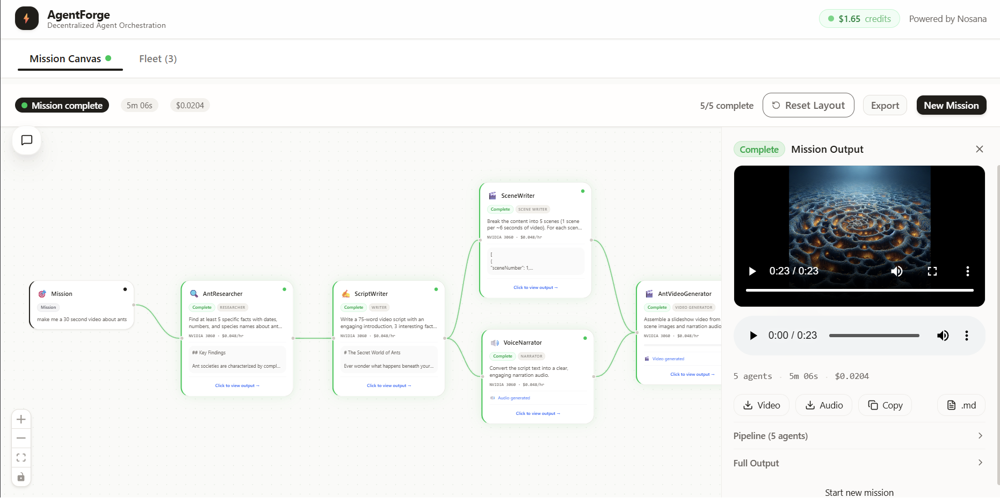
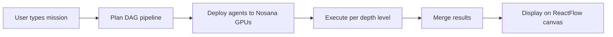
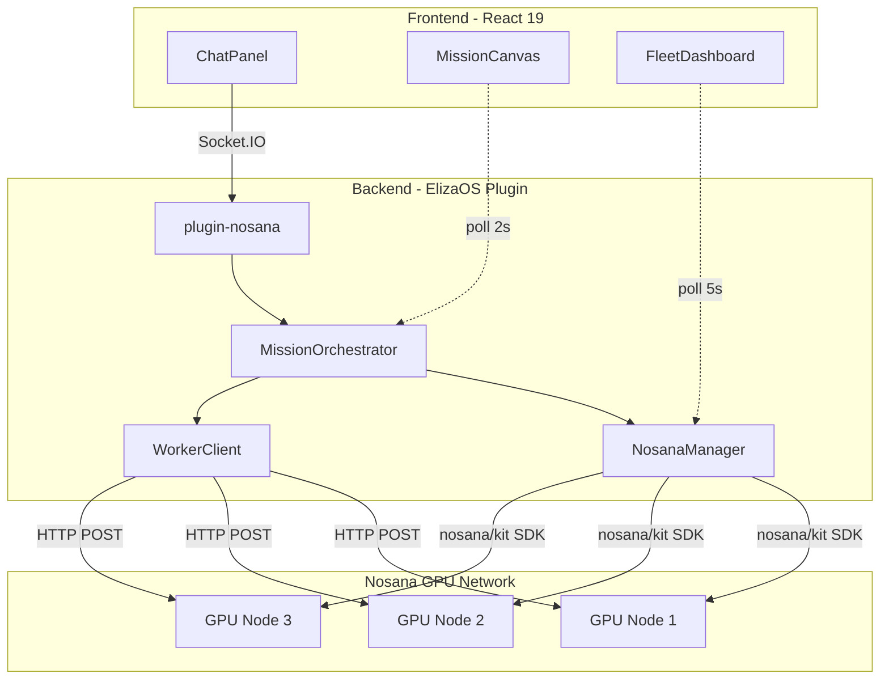
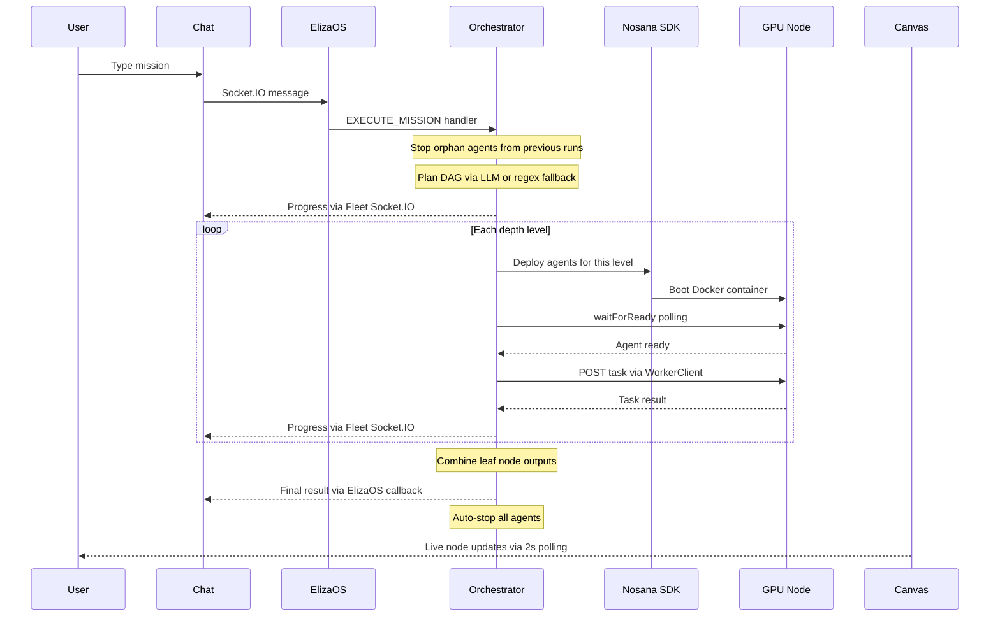
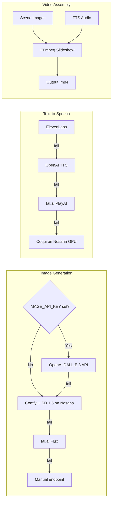
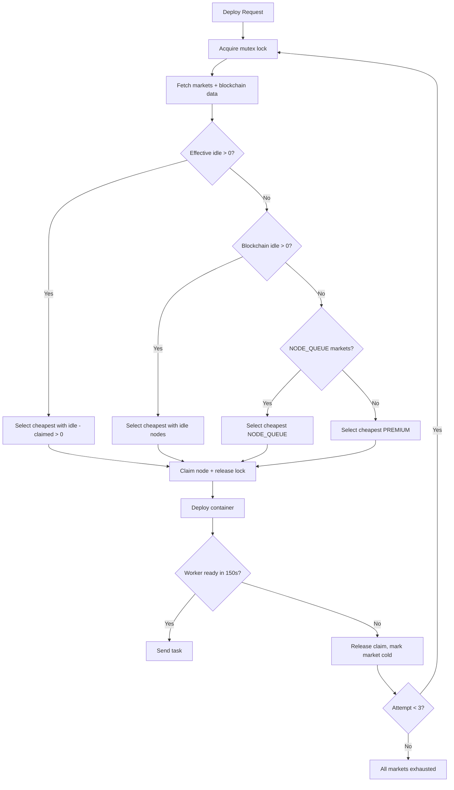

# AgentForge

-blue)     




An ElizaOS v2 plugin that turns natural language missions into multi-agent DAG pipelines running on Nosana's decentralized GPU network. Type "create a 30s video about ants" and it deploys 5 agents across separate GPU nodes, boots ComfyUI for image generation, generates TTS narration, and assembles a slideshow video. Type "compare CrewAI vs AutoGen vs ElizaOS" and it runs 3 researchers in parallel, merges results through an analyst, and shows everything live on a ReactFlow canvas.

## Quick Start

```bash
# Clone
git clone https://github.com/drew-cmd/agent-challenge-4.git
cd agent-challenge-4

# Install
bun install
cd frontend && bun install && cd ..

# Configure
cp .env.example .env
# Edit .env: set NOSANA_API_KEY from https://deploy.nosana.com/account/
# OPENAI_API_URL, MODEL_NAME, and OPENAI_API_KEY are pre-configured for Nosana inference

# Run (starts ElizaOS + Vite dev server)
bun run dev
```

Open `http://localhost:5173`. The chat connects to ElizaOS on port 3000 via Socket.IO. Fleet API runs on port 3001.

### Docker

```bash
docker build -t agentforge .
docker run -p 3000:3000 -p 3001:3001 --env-file .env agentforge
```

### Nosana Job Definition

Deploy directly to Nosana using the included job definition:

```bash
nosana job create nos_job_def/nosana_eliza_job_definition.json --market <market-address>
```

## What It Does

6 ElizaOS actions handle everything from single agent deployment to full parallel pipelines. The orchestrator plans a DAG, deploys one agent per GPU node, chains outputs between depth levels, and auto-stops everything when done to save credits.

The frontend is a split-panel app: chat on the left (Socket.IO), ReactFlow canvas or fleet dashboard on the right. The canvas updates every 2 seconds with node status, parallel execution indicators, and click-to-view output panels. Fleet dashboard shows live GPU market pricing, credit balance, and per-agent cost tracking.

9 agent templates (researcher, writer, analyst, monitor, publisher, scene-writer, image-generator, video-generator, narrator) with automatic template selection from natural language. Multimodal pipeline: ComfyUI SD 1.5 for images, ElevenLabs/OpenAI/fal.ai/Coqui for TTS, FFmpeg slideshow assembly for video. Researchers get Tavily web search with a 90-second enrichment window. Workers run as Docker containers on Nosana GPU nodes via `@nosana/kit` SDK.

## How It Works



1. User sends a mission via chat (Socket.IO to ElizaOS)
2. `EXECUTE_MISSION` action triggers the `MissionOrchestrator`
3. Orchestrator plans a DAG (LLM planner with regex fallback for competitive analysis, video, research+write patterns)
4. Pre-boots ALL GPU resources in parallel at T=0: workers + ComfyUI media service (if video/image pipeline)
5. Each worker selects its own market via atomic `selectAndClaim()` (mutex prevents oversaturation)
6. Executes level by level. Agents at the same depth run in parallel. Multimodal steps (image, video, narrator) execute directly
7. Failed dependencies cascade: if a critical step fails, downstream steps are skipped (not executed with garbage input)
8. Outputs chain forward. Video pipeline: scenes + images + TTS audio assembled into MP4 slideshow
9. All agents and media services auto-stop when complete. Credits stop burning

## Architecture



## Pipeline Flow

Full lifecycle of a mission from user input to final output:



## Key Features

**DAG Parallel Pipelines.** The orchestrator computes depth levels from the dependency graph. Agents at the same depth deploy and execute via `Promise.all`. A competitive analysis runs 3 researchers in parallel, then feeds all results to 1 analyst.

**Live ReactFlow Canvas.** Custom `MissionNode` components with status dots, progress animations, and click-to-expand output. Edges show data flow between agents. The canvas auto-layouts using depth and parallel index.

**Blockchain GPU Detection.** Market availability is read from the Nosana blockchain via `client.jobs.markets()`, not the REST API (which always returns empty). The system shows real idle node counts per market and selects markets with actual available GPUs. A `MarketClaimTracker` with an async mutex prevents parallel deploys from oversaturating the same market.

**Smart Market Distribution.** Each deployment independently selects its own market via `selectAndClaim()` (atomic lock). Deploys spread across markets based on effective idle nodes (blockchain idle minus already-claimed). If a worker times out (150s), it retries on up to 3 different markets before giving up.

**Multimodal Media Pipeline.** Video missions pre-boot ComfyUI (`docker.io/nosana/comfyui:2.0.5`) at T=0 alongside workers (skipped when `IMAGE_API_KEY` is set, since DALL-E 3 handles images via API). Image generation falls back through: DALL-E 3 (if `IMAGE_API_KEY` set), ComfyUI SD 1.5 on Nosana, fal.ai Flux, manual endpoint. TTS falls back through: ElevenLabs (with word-level timestamps), OpenAI, fal.ai PlayAI, Coqui on Nosana GPU.

**Adaptive Video Duration.** The orchestrator parses duration from mission text ("30-second video", "2-minute video", "1:30 video"). Word count, scene count, and seconds-per-scene are calculated dynamically at ~150 words per minute. Range: 15s (3 scenes, 37 words) to 5min (50 scenes, 750 words). Defaults to 30s if no duration specified. SceneWriter prompts include structured image prompt rules (shot type, lighting, style, mood) for diverse DALL-E/SD output.

**Web Search Enrichment.** Researcher agents use Tavily via `plugin-web-search`. After the initial response, `WorkerClient` polls for up to 90 seconds waiting for a web-enriched follow-up (the REPLY, WEB_SEARCH, REPLY pattern). Takes the longest response found.

**Pipeline Error Handling.** If a critical dependency fails (e.g. ScriptWriter can't boot), all downstream steps are automatically skipped instead of producing garbage output. The mission reports partial completion with succeeded/failed/skipped counts.

**Cost Tracking.** Live cost counter in the header and fleet dashboard. Per-agent cost/hr, total spent, and Nosana credit balance. GPU market cards show idle node counts from blockchain data (green = idle, yellow = busy, gray = queued).

**Dual Socket.IO Messaging.** Two Socket.IO channels serve different purposes. ElizaOS Socket.IO (port 3000) handles user chat and bookend messages that persist to conversation history. Fleet API Socket.IO (port 3001) handles ephemeral mission progress updates, bypassing ElizaOS database inserts. The frontend connects to both and merges messages into one chat stream.

## Media Pipeline

Video missions run a 5-step pipeline: Researcher, ScriptWriter, SceneWriter + Narrator (parallel), VideoGenerator. Image generation and TTS each have a multi-backend fallback chain.



When `IMAGE_API_KEY` is set (sk- prefix), DALL-E 3 handles all image generation (no GPU deployment needed, ~5s per image). When not set, ComfyUI uses `docker.io/nosana/comfyui:2.0.5` with SD 1.5 model from Nosana's S3 cache. Boot timeout is 600s (10 min) to allow model download. Pre-booted at T=0 alongside workers so it's ready when the VideoGenerator step needs it. The video pipeline routes all scene images through `ImageGenRouter.generate()`, which respects the IMAGE_API_KEY preference and falls back to ComfyUI on-demand if DALL-E fails.

## GPU Market Selection

Each deployment acquires an async mutex lock, selects a market, and claims it atomically before releasing the lock. This prevents parallel deploys from all picking the same 1-node market.



## ElizaOS Plugin Interface

| Component | Count | Details |
|-----------|-------|---------|
| `name` | - | `plugin-nosana` |
| `description` | - | Nosana decentralized GPU network integration |
| `init` | - | API key setup, market discovery, Fleet API server on port 3001, Socket.IO server |
| `actions` | 6 | EXECUTE_MISSION, CREATE_AGENT_FROM_TEMPLATE, DEPLOY_AGENT, CHECK_FLEET_STATUS, SCALE_REPLICAS, STOP_DEPLOYMENT |
| `providers` | 1 | `nosana-fleet-status` (injects fleet state into agent context) |
| `evaluators` | 1 | `MISSION_QUALITY` (scores outputs on 5 criteria: length, structure, sources, actionability, formatting) |
| `events` | 3 | MESSAGE_RECEIVED, ACTION_STARTED, ACTION_COMPLETED (tracks action duration metrics) |
| `routes` | 2 | `GET /fleet`, `GET /fleet/:id` (ElizaOS plugin routes) |
| `tests` | 5 | GPU markets, agent templates, actions, provider, evaluator+events |

## Agent Templates

| Template | Name | Plugins | Default GPU | Purpose |
|----------|------|---------|-------------|---------|
| `researcher` | Research Agent | web-search, bootstrap, openai | nvidia-3090 | Web research with Tavily search |
| `writer` | Content Writer | bootstrap, openai | cpu-only | Blog posts, reports, summaries |
| `analyst` | Data Analyst | web-search, bootstrap, openai | nvidia-3090 | Data analysis, insights, trends |
| `monitor` | Monitoring Agent | web-search, bootstrap, openai | nvidia-3090 | Periodic source monitoring |
| `publisher` | Social Publisher | bootstrap, openai | cpu-only | Social media publishing |
| `scene-writer` | Scene Writer | bootstrap, openai | cpu-only | Break content into visual scenes with image prompts |
| `image-generator` | Image Generator | (none) | nvidia-3090 | Generate images (ComfyUI/DALL-E/fal.ai) |
| `video-generator` | Slideshow Video | (none) | cpu-only | Assemble slideshow from scenes + narration |
| `narrator` | Narrator | (none) | nvidia-3090 | Convert text to speech audio |

## REST API

Fleet API server runs on port 3001 (default `127.0.0.1`, configurable via `FLEET_API_HOST`). Authenticated via `x-api-token` header (auto-generated or set via `FLEET_API_TOKEN`). Media endpoints are unauthenticated. 16 endpoints:

| Method | Path | Auth | Description |
|--------|------|------|-------------|
| GET | `/fleet/auth/token` | localhost only | Discover API token (frontend bootstrap) |
| GET | `/fleet` | yes | Fleet status with all deployments, costs, spent |
| GET | `/fleet/:id` | yes | Single deployment details |
| GET | `/fleet/:id/activity` | yes | Agent activity (messages from worker rooms) |
| GET | `/fleet/credits` | yes | Nosana credit balance |
| GET | `/fleet/markets` | yes | Live GPU market pricing with blockchain node counts |
| GET | `/fleet/mission` | yes | Current pipeline state |
| POST | `/fleet/mission/execute` | yes | Start a mission (body: `{mission: string}`, max 10,000 chars) |
| POST | `/fleet/mission/reset` | yes | Reset pipeline state |
| POST | `/fleet/mission/abort` | yes | Abort running mission |
| GET | `/fleet/mission/history` | yes | Last 50 mission results |
| GET | `/fleet/mission/history/:id` | yes | Full mission result by ID |
| GET | `/fleet/mission/export` | yes | Export pipeline as JSON |
| GET | `/fleet/media/:id` | no | Serve generated media (images, video, audio) |
| GET | `/fleet/metrics` | yes | Action execution metrics |
| GET | `/fleet/api-docs` | yes | API endpoint documentation |

## Tech Stack

| Layer | Technology | Version |
|-------|-----------|---------|
| Framework | ElizaOS v2 | ^1.0.0 |
| Language | TypeScript (strict) | ^5.0.0 / ~5.9.3 |
| Frontend | React | ^19.2.4 |
| Build | Vite | ^8.0.1 |
| Styling | Tailwind CSS | ^4.2.2 |
| UI Components | shadcn/ui | 11 components |
| Canvas | @xyflow/react | ^12.10.2 |
| State | Zustand | ^5.0.12 |
| Real-time | Socket.IO | ^4.8.3 |
| GPU Network | @nosana/kit | ^2.2.4 |
| Container | Docker | node:23-slim |
| LLM | Qwen3.5-27B-AWQ-4bit | via Nosana inference endpoint |

## Project Structure

```
src/
  index.ts                                    # ElizaOS Project entry point
  plugins/nosana/
    index.ts                                  # Plugin definition, routes, Fleet API + Socket.IO server
    types.ts                                  # Interfaces, GPU market fallbacks, 9 agent templates
    actions/
      executeMission.ts                       # Multi-agent DAG pipeline execution
      createAgentFromTemplate.ts              # Template-based agent creation
      deployAgent.ts                          # Direct container deployment
      checkFleetStatus.ts                     # Fleet status reporting
      scaleReplicas.ts                        # Replica scaling
      stopDeployment.ts                       # Graceful agent shutdown
    services/
      missionOrchestrator.ts                  # DAG planning, parallel execution, narration
      nosanaManager.ts                        # Nosana SDK wrapper, market selection, credits, claim tracker
      workerClient.ts                         # HTTP communication with deployed agents
      imageGenRouter.ts                       # Image gen fallback chain: ComfyUI, DALL-E, fal.ai
      comfyuiClient.ts                        # ComfyUI API client (queue, poll, download)
      ttsClient.ts                            # TTS fallback chain: ElevenLabs, OpenAI, fal.ai, Coqui
      mediaAssembler.ts                       # FFmpeg slideshow assembly (images + audio = MP4)
      mediaServiceDefinitions.ts              # Docker job specs for ComfyUI + Coqui TTS
      videoGenRouter.ts                       # Video generation routing (stub)
    providers/
      fleetStatusProvider.ts                  # Injects fleet state into agent context
    evaluators/
      missionQualityEvaluator.ts              # 5-criteria output quality scoring
    events/
      actionMetrics.ts                        # Action duration tracking
    tests/
      pluginTests.ts                          # 5 plugin validation tests

frontend/src/
  App.tsx                                     # Layout, tabs, polling setup
  components/
    ChatPanel.tsx                             # Chat UI, Socket.IO, mission templates
    FleetDashboard.tsx                        # GPU markets, deployments, cost tracking
    ErrorBoundary.tsx                         # React error boundary
    canvas/
      MissionCanvas.tsx                       # ReactFlow canvas, node layout, status bar
      MissionNode.tsx                         # Custom node with pill badges, glow shadows, heartbeat
      OutputPanel.tsx                         # Final output viewer with video/audio players + downloads
      NodeOutputPanel.tsx                     # Per-node output viewer with media downloads
      TruncatedMarkdown.tsx                   # Markdown renderer with HTML sanitization
  stores/
    chatStore.ts                              # Chat messages (Zustand)
    fleetStore.ts                             # Fleet state, markets, credits (Zustand)
    missionStore.ts                           # Pipeline state (Zustand)
  lib/
    elizaClient.ts                            # Dual Socket.IO client, agent discovery
    fleetPoller.ts                            # Fleet/credits/markets polling (5s/30s/60s)
    missionPoller.ts                          # Pipeline state polling (2s)
    fleetFetch.ts                             # Authenticated fetch wrapper for Fleet API
    mediaDetector.ts                          # Detect images/video/audio URLs in output
    markdown.ts                               # Markdown-to-HTML renderer with sanitization
    utils.ts                                  # Tailwind class merge utility

worker/src/
  index.ts                                    # Dynamically configured ElizaOS agent
```

## Environment Variables

| Variable | Required | Default | Description |
|----------|----------|---------|-------------|
| `NOSANA_API_KEY` | For live deployments | empty (mock mode) | Nosana platform API key |
| `OPENAI_API_KEY` | Yes | `nosana` | API key for LLM inference endpoint |
| `OPENAI_API_URL` | Yes | empty | LLM inference base URL (Nosana or Ollama) |
| `MODEL_NAME` | Yes | `Qwen3.5-27B-AWQ-4bit` | LLM model name |
| `TAVILY_API_KEY` | For web search | empty | Tavily API key for researcher agents |
| `TTS_API_KEY` | No | empty | TTS provider key. Auto-detects: sk_ = ElevenLabs, sk- = OpenAI TTS, fal_ = fal.ai |
| `IMAGE_API_KEY` | No | empty | Image gen API key. sk- = OpenAI DALL-E 3 ($0.04/img). Unset = ComfyUI on Nosana GPU |
| `FAL_API_KEY` | No | empty | fal.ai PlayAI TTS (priority 3) |
| `FAL_KEY` | No | empty | fal.ai Flux image generation |
| `COMFYUI_ENDPOINT` | No | empty | Manual ComfyUI endpoint URL |
| `A1111_ENDPOINT` | No | empty | Manual Automatic1111 endpoint URL |
| `AGENTFORGE_WORKER_IMAGE` | No | `drewdockerus/agentforge-worker:latest` | Docker image for worker agents |
| `FLEET_API_PORT` | No | `3001` | Fleet API port |
| `FLEET_API_HOST` | No | `127.0.0.1` | Fleet API bind address |
| `FLEET_API_TOKEN` | No | auto-generated | API authentication token |
| `SERVER_PORT` | No | `3000` | ElizaOS server port |
| `CORS_ORIGIN` | No | `http://localhost:5173` | CORS origin restriction (comma-separated) |

## Documentation

- **[ARCHITECTURE.md](./ARCHITECTURE.md)** - System design, component internals, data flow diagrams, service details

## Submission

Built for the [Nosana x ElizaOS Builder Challenge](https://nosana.com).

- **GitHub:** [github.com/drew-cmd/agent-challenge-4](https://github.com/drew-cmd/agent-challenge-4)
- **Docker Hub:** [`drewdockerus/agent-challenge:latest`](https://hub.docker.com/r/drewdockerus/agent-challenge), [`drewdockerus/agentforge-worker:latest`](https://hub.docker.com/r/drewdockerus/agentforge-worker)
- **Nosana Job Definition:** `nos_job_def/nosana_eliza_job_definition.json`
- **Stack:** ElizaOS v2 + Nosana GPU Network (@nosana/kit ^2.2.4) + React 19 + ReactFlow + Zustand + Tailwind 4 + shadcn/ui

## License

MIT. See [LICENSE](./LICENSE).
