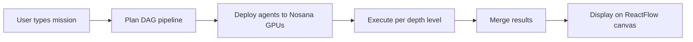
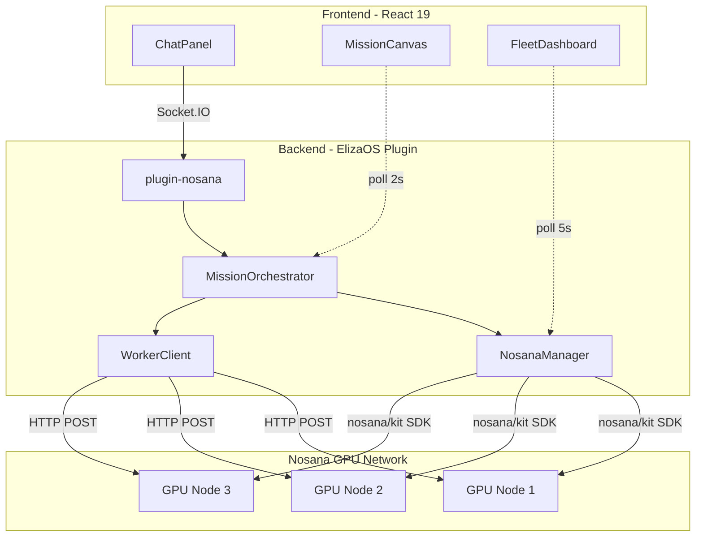
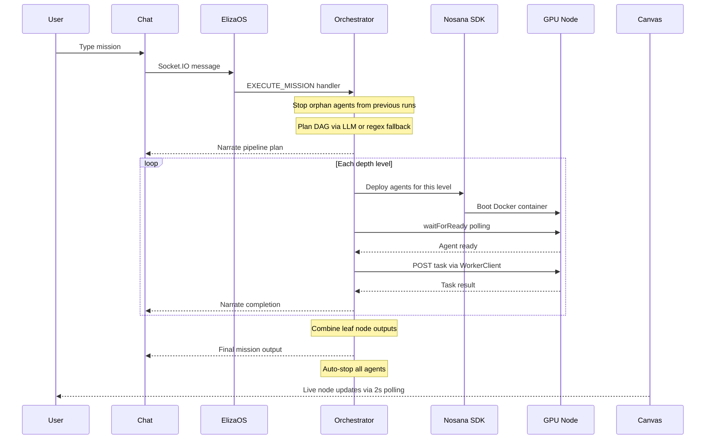
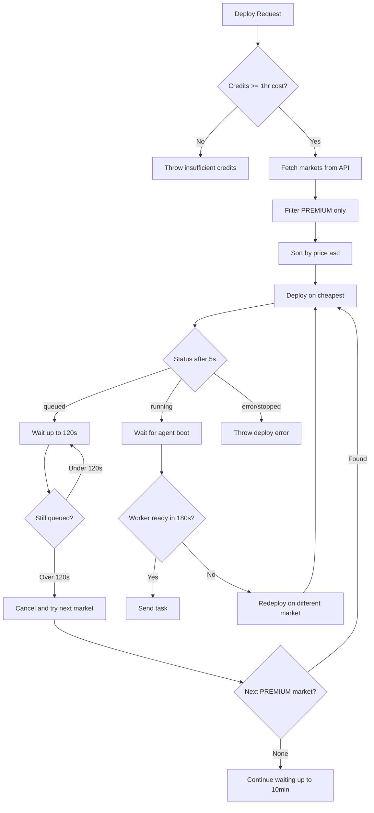

# AgentForge

-blue)     


An ElizaOS v2 plugin that turns natural language missions into multi-agent DAG pipelines running on Nosana's decentralized GPU network. You type "compare CrewAI vs AutoGen vs ElizaOS" and it deploys 5 agents across separate GPU nodes, runs 3 researchers in parallel, merges results through an analyst, and shows the whole thing live on a ReactFlow canvas.

## Quick Start

```bash
# Clone
git clone https://github.com/drew-cmd/agent-challenge-4.git
cd agent-challenge-4

# Install
bun install
cd frontend && bun install && cd ..

# Configure
cp .env.example .env
# Edit .env: set NOSANA_API_KEY from https://deploy.nosana.com/account/
# OPENAI_API_URL, MODEL_NAME, and OPENAI_API_KEY are pre-configured for Nosana inference

# Run (starts ElizaOS + Vite dev server)
bun run dev
```

Open `http://localhost:5173`. The chat connects to ElizaOS on port 3000 via Socket.IO. Fleet API runs on port 3001.

### Docker

```bash
docker build -t agentforge .
docker run -p 3000:3000 -p 3001:3001 --env-file .env agentforge
```

### Nosana Job Definition

Deploy directly to Nosana using the included job definition:

```bash
nosana job create nos_job_def/nosana_eliza_job_definition.json --market <market-address>
```

## What It Does

6 ElizaOS actions handle everything from single agent deployment to full parallel pipelines. The orchestrator plans a DAG, deploys one agent per GPU node, chains outputs between depth levels, and auto-stops everything when done to save credits.

The frontend is a split-panel app: chat on the left (Socket.IO), ReactFlow canvas or fleet dashboard on the right. The canvas updates every 2 seconds with node status, parallel execution indicators, and click-to-view output panels. Fleet dashboard shows live GPU market pricing, credit balance, and per-agent cost tracking.

5 agent templates (researcher, writer, analyst, monitor, publisher) with automatic template selection from natural language. Researchers get Tavily web search with a 90-second enrichment window. Workers run as Docker containers on Nosana GPU nodes via `@nosana/kit` SDK.

## How It Works



1. User sends a mission via chat (Socket.IO to ElizaOS)
2. `EXECUTE_MISSION` action triggers the `MissionOrchestrator`
3. Orchestrator plans a DAG (LLM planner with regex fallback for competitive analysis, research+write, and parallel patterns)
4. Deploys agents level by level. Agents at the same depth run in parallel on separate GPU nodes
5. Each agent gets its task via HTTP POST to the ElizaOS API on that GPU node
6. Outputs chain forward. The final leaf node result becomes the mission output
7. All agents auto-stop when complete. Credits stop burning

## Architecture



## Pipeline Flow

Full lifecycle of a mission from user input to final output:



## Key Features

**DAG Parallel Pipelines.** The orchestrator computes depth levels from the dependency graph. Agents at the same depth deploy and execute via `Promise.all`. A competitive analysis runs 3 researchers in parallel, then feeds all results to 1 analyst.

**Live ReactFlow Canvas.** Custom `MissionNode` components with status dots, progress animations, and click-to-expand output. Edges show data flow between agents. The canvas auto-layouts using depth and parallel index.

**GPU Market Fallback.** If a deployment gets QUEUED (no available nodes), it waits 120 seconds then cancels and redeploys on the next cheapest PREMIUM market. Tries up to 3 markets before giving up. Worker boot retry works the same way: if `waitForReady` times out after 180 seconds, it redeploys on a different market.

**Web Search Enrichment.** Researcher agents use Tavily via `plugin-web-search`. After the initial response, `WorkerClient` polls for up to 90 seconds waiting for a web-enriched follow-up (the REPLY, WEB_SEARCH, REPLY pattern). Takes the longest response found.

**Orphan Cleanup.** Before each new mission, the orchestrator stops all running agents from previous sessions. No credit leak from forgotten deployments.

**Mission Templates.** 4 one-click templates in the chat panel: Research Pipeline (3 agents), Content Pipeline (4 agents, parallel), Competitive Analysis (5 agents, parallel), Quick Agent (1 agent).

**Cost Tracking.** Live cost counter in the header and fleet dashboard. Per-agent cost/hr, total spent, and Nosana credit balance. The orchestrator narrates intermediate costs during multi-level pipelines.

## GPU Market Selection



## ElizaOS Plugin Interface

| Component | Count | Details |
|-----------|-------|---------|
| `name` | - | `plugin-nosana` |
| `description` | - | Nosana decentralized GPU network integration |
| `init` | - | API key setup, market discovery, Fleet API server on port 3001 |
| `actions` | 6 | EXECUTE_MISSION, CREATE_AGENT_FROM_TEMPLATE, DEPLOY_AGENT, CHECK_FLEET_STATUS, SCALE_REPLICAS, STOP_DEPLOYMENT |
| `providers` | 1 | `nosana-fleet-status` (injects fleet state into agent context) |
| `evaluators` | 1 | `MISSION_QUALITY` (scores outputs on 5 criteria: length, structure, sources, actionability, formatting) |
| `events` | 3 | MESSAGE_RECEIVED, ACTION_STARTED, ACTION_COMPLETED (tracks action duration metrics) |
| `routes` | 2 | `GET /fleet`, `GET /fleet/:id` |
| `tests` | 5 | GPU markets, agent templates, actions, provider, evaluator+events |

## Agent Templates

| Template | Name | Plugins | Default GPU | Purpose |
|----------|------|---------|-------------|---------|
| `researcher` | Research Agent | web-search, bootstrap, openai | nvidia-3090 | Web research with Tavily search |
| `writer` | Content Writer | bootstrap, openai | cpu-only | Blog posts, reports, summaries |
| `analyst` | Data Analyst | web-search, bootstrap, openai | nvidia-3090 | Data analysis, insights, trends |
| `monitor` | Monitoring Agent | web-search, bootstrap, openai | nvidia-3090 | Periodic source monitoring |
| `publisher` | Social Publisher | bootstrap, openai | cpu-only | Social media publishing |

## REST API

Fleet API server runs on port 3001 (standalone Express, started in `init`). 12 endpoints:

| Method | Path | Description |
|--------|------|-------------|
| GET | `/fleet` | Fleet status with all deployments, costs, spent |
| GET | `/fleet/:id` | Single deployment details |
| GET | `/fleet/:id/activity` | Agent activity (messages from worker rooms) |
| GET | `/fleet/credits` | Nosana credit balance |
| GET | `/fleet/markets` | Live GPU market pricing |
| GET | `/fleet/mission` | Current pipeline state |
| POST | `/fleet/mission/execute` | Start a mission (body: `{mission: string}`, max 10,000 chars) |
| POST | `/fleet/mission/reset` | Reset pipeline state |
| GET | `/fleet/mission/history` | Last 10 mission results |
| GET | `/fleet/mission/export` | Export pipeline as JSON |
| GET | `/fleet/metrics` | Action execution metrics |
| GET | `/fleet/api-docs` | API documentation |

## Tech Stack

| Layer | Technology | Version |
|-------|-----------|---------|
| Framework | ElizaOS v2 | ^1.0.0 |
| Language | TypeScript (strict) | ^5.0.0 / ~5.9.3 |
| Frontend | React | ^19.2.4 |
| Build | Vite | ^8.0.1 |
| Styling | Tailwind CSS | ^4.2.2 |
| UI Components | shadcn/ui | 11 components |
| Canvas | @xyflow/react | ^12.10.2 |
| State | Zustand | ^5.0.12 |
| Real-time | Socket.IO | ^4.8.3 |
| GPU Network | @nosana/kit | ^2.2.4 |
| Container | Docker | node:23-slim |
| LLM | Qwen3.5-27B-AWQ-4bit | via Nosana inference endpoint |

## Project Structure

```
src/
  index.ts                                    # ElizaOS Project entry point
  plugins/nosana/
    index.ts                                  # Plugin definition, routes, Fleet API server
    types.ts                                  # Interfaces, GPU market fallbacks, agent templates
    actions/
      executeMission.ts                       # Multi-agent DAG pipeline execution
      createAgentFromTemplate.ts              # Template-based agent creation
      deployAgent.ts                          # Direct container deployment
      checkFleetStatus.ts                     # Fleet status reporting
      scaleReplicas.ts                        # Replica scaling
      stopDeployment.ts                       # Graceful agent shutdown
    services/
      missionOrchestrator.ts                  # DAG planning, parallel execution, narration
      nosanaManager.ts                        # Nosana SDK wrapper, market selection, credits
      workerClient.ts                         # HTTP communication with deployed agents
    providers/
      fleetStatusProvider.ts                  # Injects fleet state into agent context
    evaluators/
      missionQualityEvaluator.ts              # 5-criteria output quality scoring
    events/
      actionMetrics.ts                        # Action duration tracking
    tests/
      pluginTests.ts                          # 5 plugin validation tests

frontend/src/
  App.tsx                                     # Layout, tabs, polling setup
  components/
    ChatPanel.tsx                             # Chat UI, Socket.IO, mission templates
    FleetDashboard.tsx                        # GPU markets, deployments, cost tracking
    ErrorBoundary.tsx                         # React error boundary
    canvas/
      MissionCanvas.tsx                       # ReactFlow canvas, node layout, status bar
      MissionNode.tsx                         # Custom node component with status indicators
      OutputPanel.tsx                         # Final mission output viewer
      NodeOutputPanel.tsx                     # Per-node output viewer
  stores/
    chatStore.ts                              # Chat messages (Zustand)
    fleetStore.ts                             # Fleet state, markets, credits (Zustand)
    missionStore.ts                           # Pipeline state (Zustand)
  lib/
    elizaClient.ts                            # Socket.IO client, agent discovery
    fleetPoller.ts                            # Fleet/credits/markets polling (5s/30s/60s)
    missionPoller.ts                          # Pipeline state polling (2s)
    markdown.ts                               # Markdown-to-HTML renderer with sanitization
    utils.ts                                  # Tailwind class merge utility

worker/src/
  index.ts                                    # Dynamically configured ElizaOS agent
```

## Environment Variables

| Variable | Required | Default | Description |
|----------|----------|---------|-------------|
| `NOSANA_API_KEY` | For live deployments | empty (mock mode) | Nosana platform API key |
| `OPENAI_API_KEY` | Yes | `nosana` | API key for LLM inference endpoint |
| `OPENAI_API_URL` | Yes | empty | LLM inference base URL (Nosana or Ollama) |
| `MODEL_NAME` | Yes | `Qwen3.5-27B-AWQ-4bit` | LLM model name |
| `TAVILY_API_KEY` | For web search | empty | Tavily API key for researcher agents |
| `AGENTFORGE_WORKER_IMAGE` | No | `drewdockerus/agentforge-worker:latest` | Docker image for worker agents |
| `FLEET_API_PORT` | No | `3001` | Fleet API port |
| `SERVER_PORT` | No | `3000` | ElizaOS server port |
| `CORS_ORIGIN` | No | all origins | CORS origin restriction (set in production) |

## Documentation

- **[ARCHITECTURE.md](./ARCHITECTURE.md)** - System design, component internals, data flow diagrams, service details

## Submission

Built for the [Nosana x ElizaOS Builder Challenge](https://nosana.com).

- **GitHub:** [github.com/drew-cmd/agent-challenge-4](https://github.com/drew-cmd/agent-challenge-4)
- **Docker Hub:** [`drewdockerus/agent-challenge:latest`](https://hub.docker.com/r/drewdockerus/agent-challenge), [`drewdockerus/agentforge-worker:latest`](https://hub.docker.com/r/drewdockerus/agentforge-worker)
- **Nosana Job Definition:** `nos_job_def/nosana_eliza_job_definition.json`
- **Stack:** ElizaOS v2 + Nosana GPU Network (@nosana/kit ^2.2.4) + React 19 + ReactFlow + Zustand + Tailwind 4 + shadcn/ui
